# Installing and running the PnP Partner Pack app locally

The PnP Partner Pack allows you to extend the out of the box experience of Microsoft Office 365 and Microsoft SharePoint Online by providing the following capabilities:
* **Save Site as Provisioning Template** feature in Site Settings
* **Sub-Site creation**  with custom UI and PnP Provisioning Template selection
* **Site Collection creation for non-admin users** with custom UI and PnP Provisioning Template selection
* **My Site Collections** personal view
* **Responsive Design** template for Site Collections
* **Governance** tools for administrators: apply SharePoint farm-wide branding, refresh site templates, bulk creation of site collections 
* **Sample Timer Jobs** (implemented as WebJobs) for Governance rules enforcement

For more information about the PnP Program, please, refer this link:

[http://aka.ms/OfficeDevPnP](http://aka.ms/OfficeDevPnP)

For more information about the PnP Partner pack, please, refer this link:

[https://github.com/SharePoint/PnP-Partner-Pack](https://github.com/SharePoint/PnP-Partner-Pack)

## Steps to install PnP Partner Pack locally

For a better understanding of the Setup process, please read the following document, as it will give you the basics about the entire set up process on an Azure subscription:

[https://github.com/SharePoint/PnP-Partner-Pack/blob/master/Documentation/Manual-Setup-Guide.md](https://github.com/SharePoint/PnP-Partner-Pack/blob/master/Documentation/Manual-Setup-Guide.md)

For the local setup, we will follow some of the points described in the previous link, with some modifications and other steps.

The local setup requires accomplishing the following steps:

1. Create the self-signed certificate
2. Azure Active Directory Application registration
3. Update Azure AD Application manifest
4. Infrastructural Site Collection provisioning
5. Register self-signed certificate locally (to use with IIS Express)
6. Partner Pack solution configuration

### Create the self-signed certificate

To create the self-signed certificate, follow these instructions:

[https://github.com/SharePoint/PnP-Partner-Pack/blob/master/Documentation/Manual-Setup-Guide.md#createcertificate](https://github.com/SharePoint/PnP-Partner-Pack/blob/master/Documentation/Manual-Setup-Guide.md#createcertificate)

Basically, you just need to run a Script provided in the Partner Pack package and it will create the certificate for you:

```PowerShell
.\Create-SelfSignedCertificate.ps1 -CommonName &quot;MyCompany&quot; -StartDate 2017-01-01 -EndDate 2040-01-01_
```

**Note** : Please, store the password used to create the certificate as you will need it later to register the certificate in the local certificate storage.

### Azure Active Directory Application registration

Now, we need to register an Azure Active Directory Application. This step is described here:

[https://github.com/SharePoint/PnP-Partner-Pack/blob/master/Documentation/Manual-Setup-Guide.md#azuread](https://github.com/SharePoint/PnP-Partner-Pack/blob/master/Documentation/Manual-Setup-Guide.md#azuread)

but we need to point the Sign-on URL to the Local URL that is using the PnP Partner Pack:

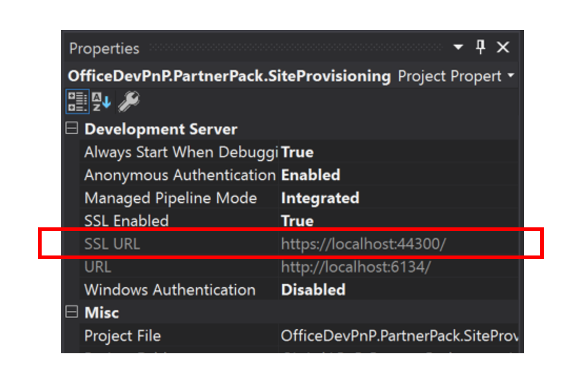

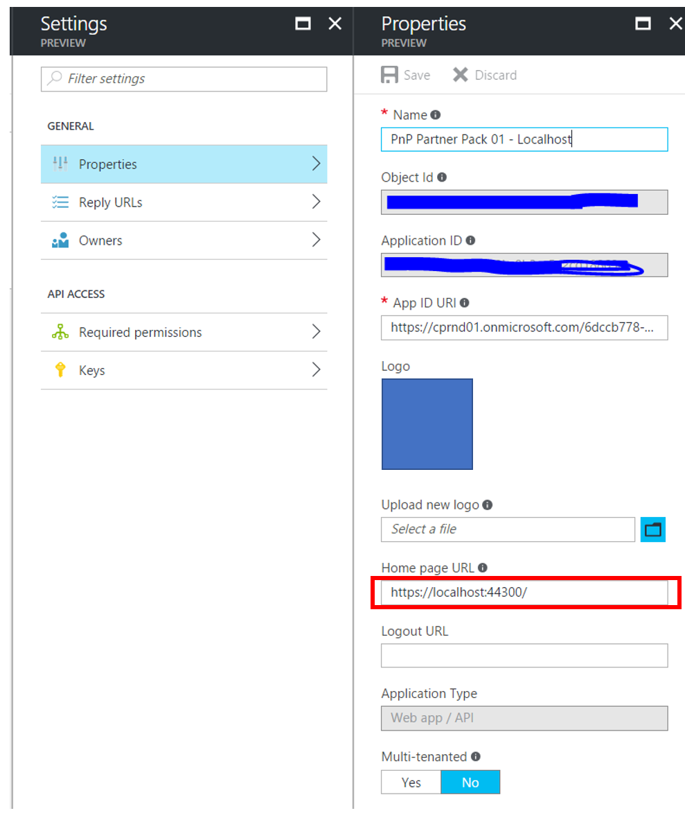

Don’t forget to follow the rest of the steps from the previous link, to create the Key and configure the right permissions.

### Update Azure AD Application manifest

Now you need to follow the steps described here:

[https://github.com/SharePoint/PnP-Partner-Pack/blob/master/Documentation/Manual-Setup-Guide.md#apponlyazuread](https://github.com/SharePoint/PnP-Partner-Pack/blob/master/Documentation/Manual-Setup-Guide.md#apponlyazuread)

Basically, you have to run the PnP Power Shell command:
```PowerShell
Get-PnPAzureADManifestKeyCredentials -CertPath C:\_Lab\PnP-Partner-Pack-master\scripts\ClearPeopleAtum.cer | clip
```

That will copy in the clipboard the required information to update the Azure AD App Manifest. With that information, you must edit the App Manifest, that you can do it easily from the Azure Portal:

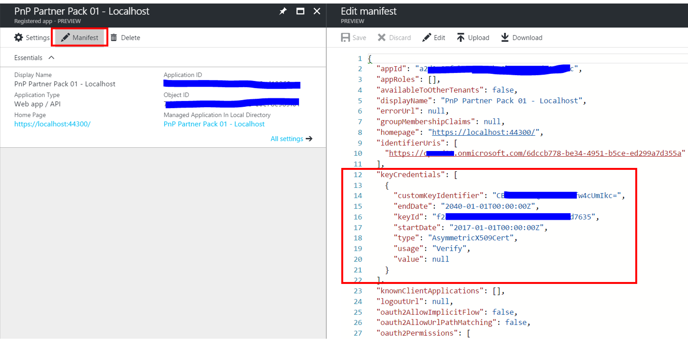

Next, we have to get the _Thumbprint_ of your Certifcate. This is also well-explained in the previous link, but basically, you need to run the following PowerShell script:

```PowerShell
$certPath = Read-Host "Enter certificate path (.cer)"
$cert = New-Object System.Security.Cryptography.X509Certificates.X509Certificate2
$cert.Import($certPath)
Write-Host "Certificate Thumbprint:" $cert.Thumbprint
```

Copy the certificate _Thumbprint_, as you will need it later for the Configuration section.

### Infrastructural Site Collection provisioning

Now, we need to provision the **Infrastructural Site Collection**. This site collection is required for the PnP Partner pack app to store some information about the provisioning Jobs. You can follow the steps described in this link:

[https://github.com/SharePoint/PnP-Partner-Pack/blob/master/Documentation/Manual-Setup-Guide.md#sitecollection](https://github.com/SharePoint/PnP-Partner-Pack/blob/master/Documentation/Manual-Setup-Guide.md#sitecollection)

We suggest following the recommended approach, so you just need to run the following PowerShell commands:

```PowerShell
Connect-PnPOnline "https://[Tenant]-admin.sharepoint.com/"

New-PnPTenantSite -Title "PnP Partner Pack - Infrastructural Site" -Url "https:// [Tenant].sharepoint.com/sites/PnP-Partner-Pack-Infrastructure" -Owner "admin@[Tenant].onmicrosoft.com" -Lcid 1033 -Template "STS#0" -TimeZone 4 -RemoveDeletedSite
```

Once the site collection is already created, we have to run the following _Script_ provided with the PnP Partner Pack package:

```PowerShell
.\Provision-InfrastructureSiteArtifacts.ps1 -InfrastructureSiteUrl https:// [Tenant].sharepoint.com/sites/pnp-partner-pack-infrastructure -AzureWebSiteUrl https://localhost:44300/
```

Previous command will deploy all the required assets (files, libraries and so on) to the Instrastructural site collection.

### Register self-signed certificate locally (to use with IIS Express)

This is a new step that is not required if you are installing the PnP Partner Pack in Azure, but you will need it to run the code locally, as IIS Express will try to get the certificate from the local certificate storage.
To do that, run the “mmc” command:

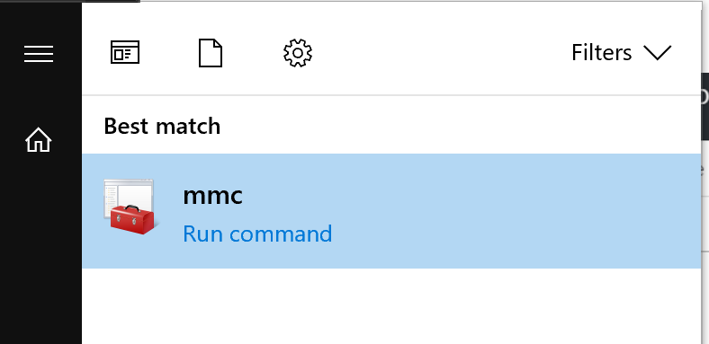

Add the certificate snap-in:

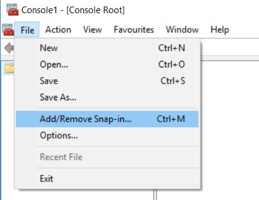

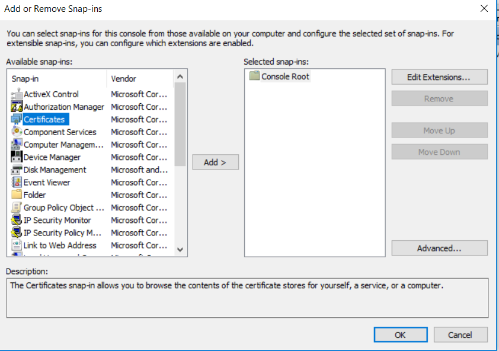

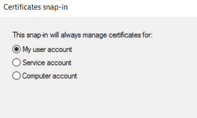

Once the snap-in is added, unfold the **“Personal”** folder. Then, right click to the **“Certificates”** folder and select **“Import”**

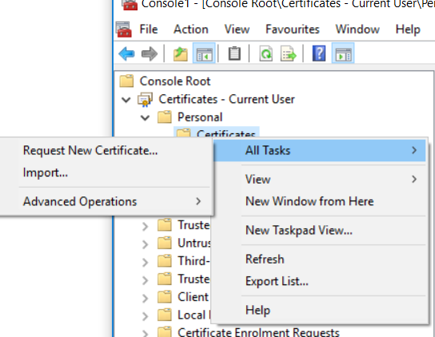

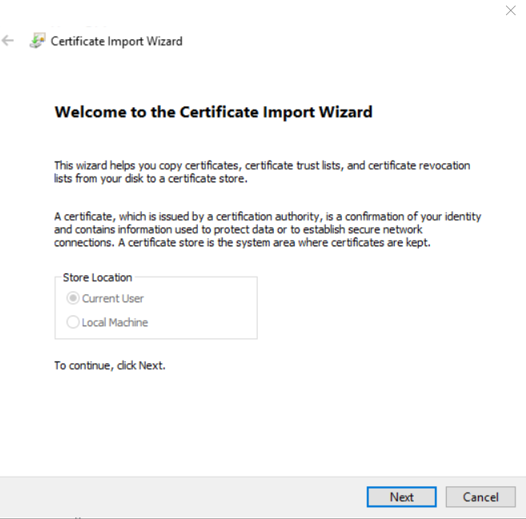

Then, select you **“.cer”** file

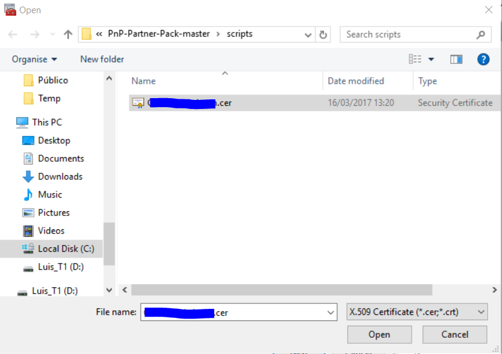

Once the Certificate has been Imported successfully, you will need to repeat the same steps, but using the **“.pfx”** file (change the extensions drop down, as is defaulted to the .cer extension):

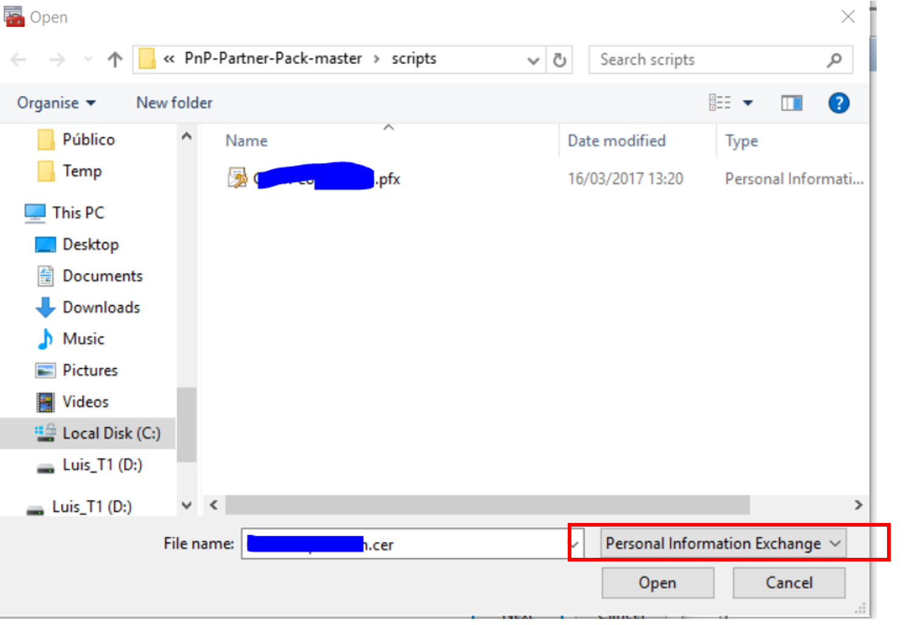

You will be asked to provide the Password you used to create the certificate.

Once is imported, open the certificate from the snap-in, and ensure the certificate says: _“You have a private key that corresponds to this certificate”_

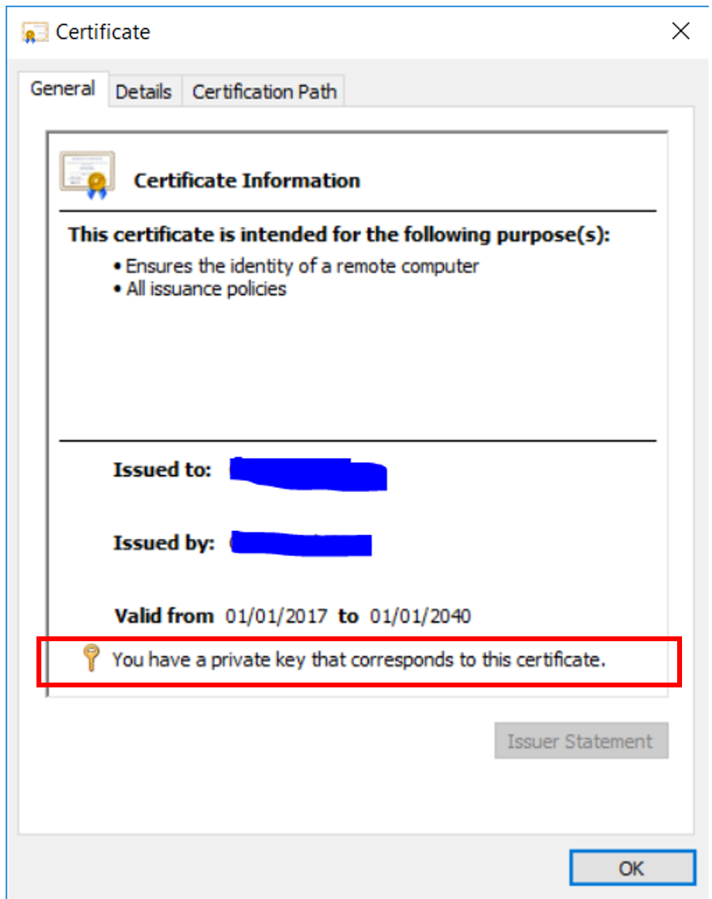

### Partner Pack solution configuration

You can read the following link to get a better understanding on which configuration need to be updated. 

[https://github.com/SharePoint/PnP-Partner-Pack/blob/master/Documentation/Manual-Setup-Guide.md#configconfigs](https://github.com/SharePoint/PnP-Partner-Pack/blob/master/Documentation/Manual-Setup-Guide.md#configconfigs)

However, you cannot use the provided script, as it will configure the Azure Web App. So, you need to apply the following changes manually:
Edit the **Web.config** file from: _“…PnP-Partner-Pack-master\OfficeDevPnP.PartnerPack.SiteProvisioning\OfficeDevPnP.PartnerPack.SiteProvisioning\Web.config”_

**Point the Azure Storage Connection string to the Local Emulator**

**Note**: This is only required if you configure the webjobs to run Sequentially, as then, a message will be queued to the Local Storage Queue. However, although the Website will be queued a message in the local emulator, the Synchronous WebJob in the solution, will not be able to get the message, as the Azure webjobs SDK does not support the Emulator. So, this step is not very useful, unless you want to debug how the message is enqueued from the WebSite).

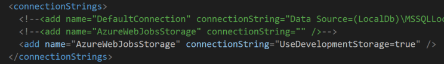

**Configure Azure AD Settings**

Using the Client ID and Secret from the Azure AD App registry:

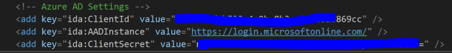

**Configure Tenant settings and Certificate Thumbprint**

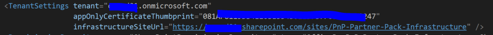

**Configure the Jobs to run Scheduled**

As pointed out previously, although the Website can add a message to the Azure storage emulator, the Azure Webjobs SDK will not pick it up later, meaning that the code in the ContinuosJob that is monitoring the Queue, will never get fire. This code is never fire using the Azure emulator:

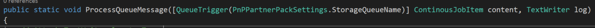

However, we can configure the Jobs to run “Scheduled”, and then, they will be picked up by the “ScheduledJob”. That job does not use the Azure Storage, and gets all the required information from a SharePoint library in the Infrastructural site collection.

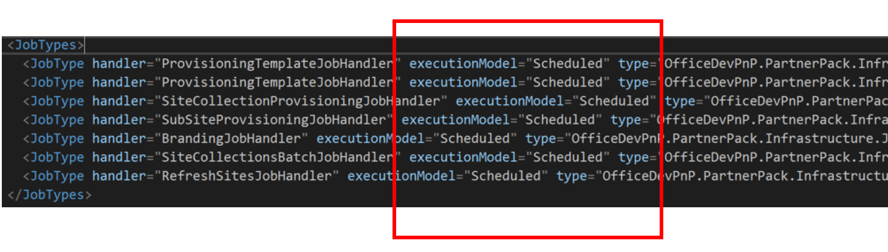

Also, keep in mind that you could use a valid Azure Storage account in an Azure subscription, and then you will be able to run the _ContinuousJob_ locally, but using the Storage in Azure.

**Note**: You will need to repeat these changes in the “App.config” for the “ScheduledJob” project.

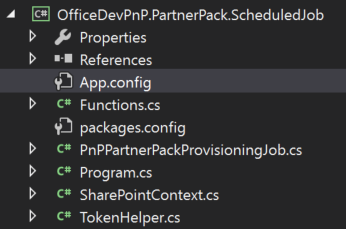

### Running PnP PartnerPack Locally

Once you are done with all the previous steps, you can run the solution locally:

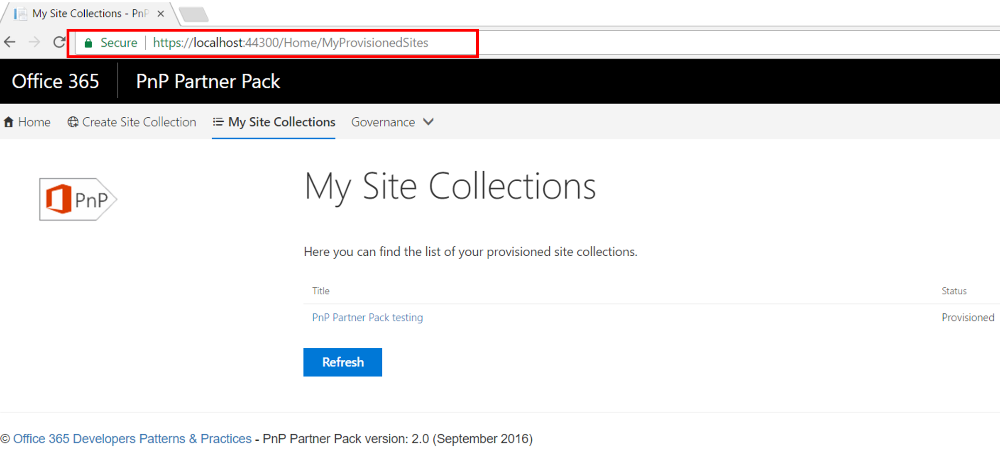

Then, once you have enqueued any operation (Create Site Collection, SubSite, etc), you can run another instance of the _ScheduledJob_, and it will do the job.

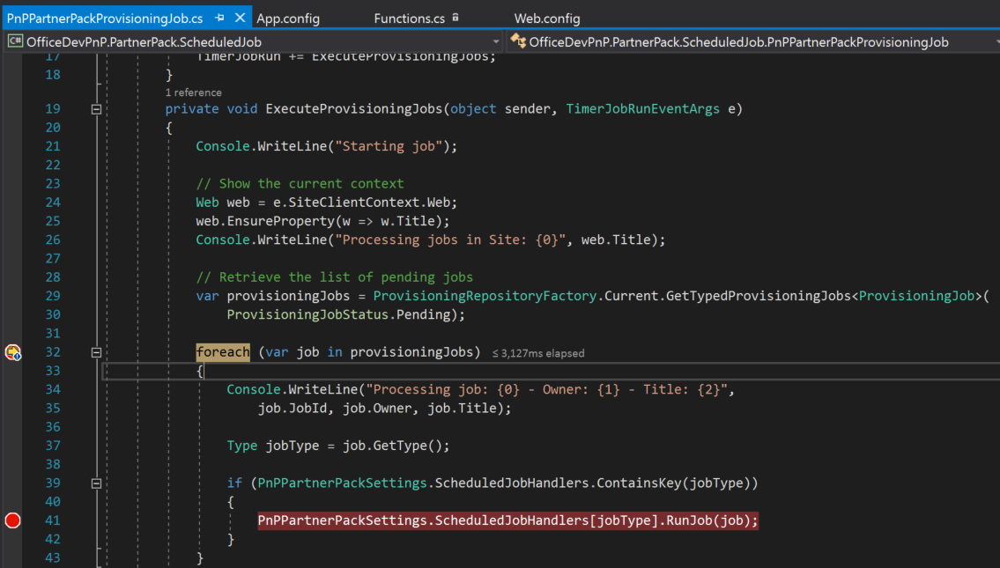