# PnP Partner Pack - Manual Setup Guide

## Solution Overview
The PnP Partner Pack allows you to extend the out of the box experience of Microsoft Office 365 and Microsoft SharePoint Online by providing the following capabilities:
* **Save Site as Provisioning Template** feature in Site Settings
* **Sub-Site creation**  with custom UI and PnP Provisioning Template selection
* **Site Collection creation for non-admin users** with custom UI and PnP Provisioning Template selection
* **My Site Collections** personal view
* **Responsive Design** template for Site Collections
* **Governance** tools for administrators: apply SharePoint farm-wide branding, refresh site templates, bulk creation of site collections 
* **Sample Timer Jobs** (implemented as WebJobs) for Governance rules enforcement

This document describes the deployment for the **PnP Partner Pack version 2.0 (September 2016)**.
Follow step by step the detailed instructions provided in this document, if you like to manually setup the PnP Partner Pack version 2.0.

Keep in mind that since March 2017 you can also **setup the PnP Partner Pack using a tool**. Please follow the instructions provided in the video about the [Setup Wizard](https://www.youtube.com/watch?v=D98jqzPkfj0&index=34&list=PLR9nK3mnD-OUnJytlXlO84fQnYt50iTmS) to understand how it works and how to use it. The **Setup Wizard** is a UI based desktop Setup application (for Windows OS only) that allows you to fully automate the setup process.

## Setup Overview
From a deployment perspective the PnP Partner Pack is an Office 365 Application, which leverages an Azure Web App with an Azure Web Sites and some Azure Web Jobs. The application has to be registered in Azure Active Directory and acts against SharePoint Online using an App Only access token, based on an X.509 self-signed Certificate. Moreover, it is a requirement to have an Infrastructural Site Collection provisioned in the target SharePoint Online tenant.

This document outlines the manual setup process, which allows you to use the PnP Partner Pack in your own environment.

If you already installed the PnP Partner Pack version 1.1 and you are upgrading it to the latest version, which currently is version 2.0, you can read the following <a href="./Upgrade-From-v1_1-to-v2_0.md">upgrade guide</a>, instead of reading this setup guide.

If you already installed the PnP Partner Pack version 1.0 and you are upgrading it to the latest version, which currently is version 2.0, you can read the following <a href="./Upgrade-From-v1_0-to-v2_0.md">upgrade guide</a>, instead of reading this setup guide.

Notice that the UI based desktop Setup application (for Windows OS only) that will be released pretty soon, will also provide the capability to upgrade an already installed version of the PnP Partner Pack.

## Requirements
In order to setup the PnP Partner Pack you need:
* A valid **Microsoft Office 365 tenant** with at least an active subscription
* The **PnP PowerShell cmdlets** (available here: http://aka.ms/OfficeDevPnPPowerShell). The minimum version you need is version 2.7.1609.2. To double-check the version of the PnP PowerShell cmdlets, you can invoke the `Connect-PnPOnline`  cmdlet with the `-Verbose` argument

## Installation Steps
The manual installation requires to accomplish the following steps:
* [Create the self-signed certificate](#createcertificate)
* [Azure Blob Storage creation](#azureblob)
* [Azure App Service provisioning](#azurewebapp)
* [App Only certificate configuration in the Azure App Service](#apponlywebapp)
* [Azure Active Directory Application registration](#azuread)
* [Update Azure AD Application manifest](#apponlyazuread)
* [Infrastructural Site Collection provisioning](#sitecollection)
* [Partner Pack solution configuration](#configconfigs)
* [Azure Web Jobs provisioning](#webjobs)

During the setup guide you will often find two suitable alternatives to achieve your goal. The first option will be to use some ready to go PowerShell scripts, which is the preferred solution. Alternatively if you rather prefer to setup everything manually you will find some detailed manual steps.

<a name="createcertificate"></a>
### Create the self signed certificate
You are now ready to configure the Azure AD Application for invoking SharePoint Online with an App Only access token. In order to do that, you have to create and configure a self-signed X.509 certificate, which will be used to authenticate your Application against Azure AD, while requesting the App Only access token. 

First of all, you have to create the self-signed X.509 Certificate, which can be created using the [makecert.exe](https://msdn.microsoft.com/library/windows/desktop/aa386968.aspx) tool that is available in the Windows SDK or through a provided PowerShell script which does not have a dependency to makecert. Using the PowerShell script is the preferred method.

**Important:** 
It's important that you run the below scripts with Administrator privileges.

#### Using the Create-SelfSignedCertificate PowerShell Script
You can use a provided PowerShell script which does not have a dependency to makecert.exe. The script is called <a href="../scripts/Create-SelfSignedCertificate.ps1">Create-SelfSignedCertificate.ps1</a> and is available in the <a href="../scripts/">Scripts folder</a> of this repository.

To create a self signed certificate with this script:

```PowerShell
.\Create-SelfSignedCertificate.ps1 -CommonName "MyCompanyName" -StartDate 2015-10-25 -EndDate 2016-10-25
```

You will be asked to provide a password to encrypt your private key, and both the .PFX file and .CER file will be exported to the current folder.

#### Using makecert (alternative manual option)
Alternatively, if you have Microsoft Visual Studio 2013/2015/2017 installed on your environment, you already have the [makecert tool](https://msdn.microsoft.com/library/windows/desktop/aa386968.aspx), as well. Otherwise, you will have to download from MSDN and to install the Windows SDK for your current version of Windows Operating System.

The command for creating a new self-signed X.509 certificate is the following one:

```
makecert -r -pe -n "CN=MyCompanyName MyAppName Cert" -b 10/25/2015 -e 10/25/2016 -ss my -len 2048
```

The previous command creates a self-signed certificate with a common name (CN) value of "MyCompanyName MyAppName Cert", a validity timeframe between 10/25/2015 and 10/25/2016, and a key length of 2048 bit. The certificate will have an exportable private key and will be stored in the personal certificate store of the current user. 

>For further details about the makecert syntax and command line parameters you can read <a href="https://msdn.microsoft.com/en-us/library/windows/desktop/aa386968(v=vs.85).aspx">the following article</a> on MSDN.

After having created the self-signed X.509 Certificate you have to export it as a .PFX file, which includes the private key value. In order to do that, run the **mmc.exe** command as an Administrator (RunAs Admin) and add the **Certificates MMC** snap-in, targeting the personal store of the current user. In the Current User's Personal folder of Certificates, select the just created certificate, right click on it and select the "Export" functionality. Select to export the private key into a .PFX file. Provide a password to protect the private key of the certificate. Repeat the same process as before, but this time export the certificate as a .CER file, which does not include the private key value.


<a name="azureblob"></a>
### Azure Blob Storage configuration
To handle some asynchronous tasks, the PnP Partner Pack uses an Azure Blob Storage service to queue items. Thus, you will need to configure an Azure Blob Storage account, in case you don't have one yet.

Go Back to the new Azure Portal, and find **Storage Accounts** menu option. You can either use an existing account or create a new one. If you are to create a new one you'll then be presented with the following screen:

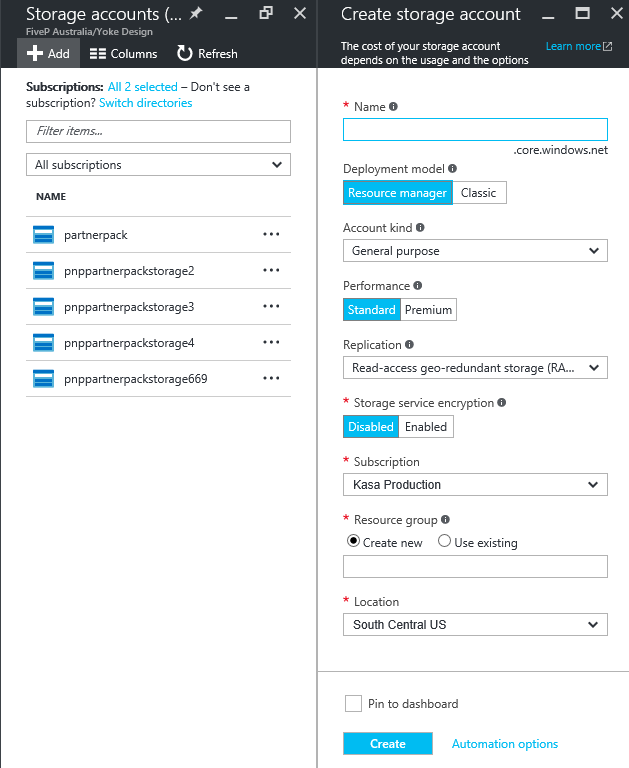

After having created the Azure Blob Storage account, open the "Manage Access Keys" popup screen and copy the values of **"Storage Account Name"**, and **"Primary Access Key"**. Alternatively if using the new Azure Portal, click on your Storage account, click on **"Access keys"** under the Settings header and copy out the **"Storage account name"** and **"key1"** values.

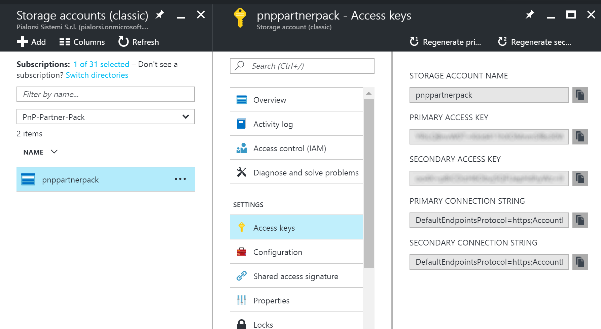

<a name="azurewebapp"></a>
### Azure App Service provisioning
You will also need to **provision an Azure App Service** that will host both the Azure Web Site for the PnP Partner Pack main web application, and the various Web Jobs under the cover of the PnP Partner Pack.

Back to the New Azure Portal, you will need to create a new **Web App**. Call it with whatever name you like. For example, you can call it pnp-partner-pack-[tenant]. See the next figure for a sample configuration. The figure includes the App Service Plan your app will use. The pricing tier needs to be at least to level "BASIC" that allows management of custom X.509 certificates.

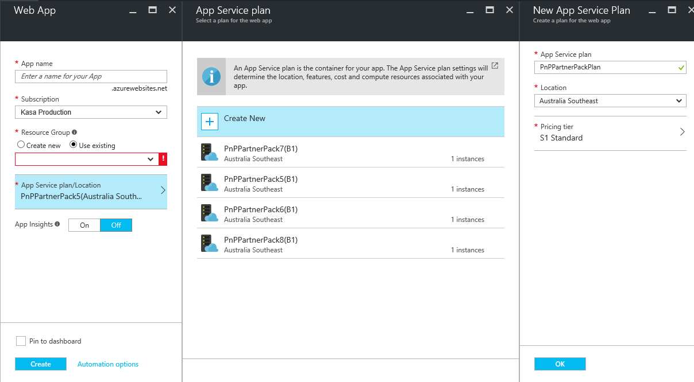

<a name="apponlywebapp"></a>
### App Only certificate configuration in the Azure App Service

Once your app is created you will need to upload the .PFX file of the self-signed certificate to create the App Only context. Thus, go into the **"Configuration"** tab and add a new X.509 certificate to the Azure Web App, through the proper configuration section. Alternatively through the new Azure Portal you will go into the App Service, click on **"SSL certificates"**, click on the **"Upload Certificate"** menu at the top, select the PFX certificate that you have created earlier on in these steps and click on **"Upload"**.

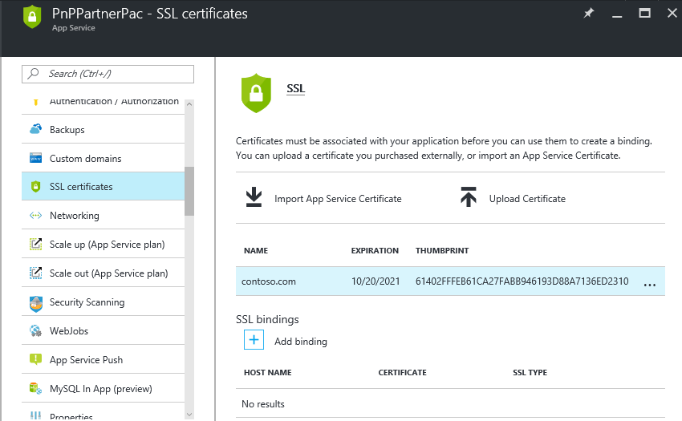

After that, scroll a little bit to the "Application Settings" section. There, you will have to configure the following settings:
- *WEBSITE_LOAD_CERTIFICATES* with a value of *;
- *WEBJOBS_IDLE_TIMEOUT* with a value of 10000;
- *SCM_COMMAND_IDLE_TIMEOUT* with a value of 10000;

In the following figure you can see a sample configuration. 

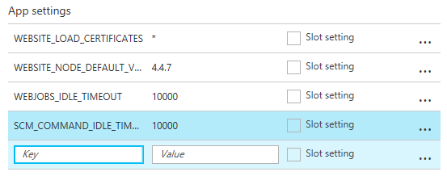

"WEBSITE_LOAD_CERTIFICATES" allows the Azure App Service to access the service account's personal certificate store to read the App Only X.509 certificate. The last two properties allow the web jobs to run for longer than 2 minutes. 


<a name="azuread"></a>
### Azure Active Directory Application registration
First of all, because the PnP Partner Pack is an Office 365 Application, you have to **register it in the Azure Active Directory tenant** that is linked to your Office 365 tenant. In order to do that, open the Office 365 Admin Center (https://portal.office.com) using the account of a user member of the Tenant Global Admins group.

Click on the "Azure AD" link that is available under the "Admin centers" group in the left-side treeview of the Office 365 Admin Center. In the new browser's tab that will be opened you will find the Microsoft Azure Management Portal. If it is the first time that you access the Azure Management Portal with your account, you will have to register a new Azure subscription, providing some information and a credit card for any payment need. But don't worry, in order to play with Azure AD and to register an Office 365 Application you will not pay anything. In fact, those are free capabilities. 

Once having access to the Azure Management Portal, select the "Active Directory" section, by clicking on the icon highlighted in the following screen shot:


If you can't see Azure Active Directory as one of your options then scroll to the end of the left menu and click on "More Services". You'll find "Azure Active Directory"  there. Please favorite the feature as you'll need this later.

You'll see on the left side of the blade that you opened the Azure AD tenant corresponding to your Office 365 tenant. Locate and select the option "App Registrations". See the next figure for further details.

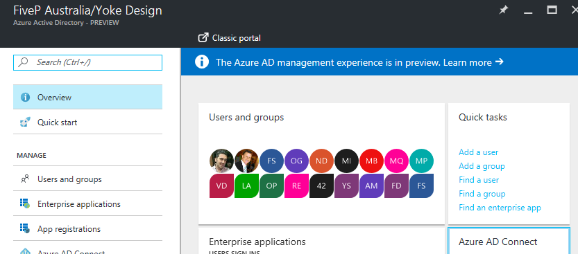

In the "App Registrations" tab you will find the list of Azure AD applications registered in 
your tenant. Click the "Add" button in the upper left part of the blade, this will show you the following screen.

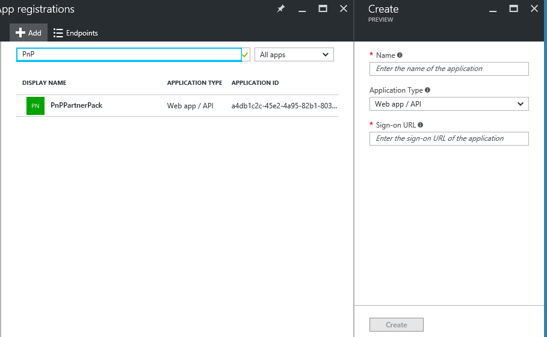

Then, provide a **name** for your application (we suggest to name it "SharePoint PnP Partner Pack"), select the option **"Web app / API"**, and fill in the **"Sign-on URL"** with the **URL** of the Azure App Service that you created before. Make sure to use a forward slash at the end of the URL (otherwise you will get a 'reply address does not match error'). Click create when done.

The newly created app registration will now be listed in your "App Registrations" list.
Open it and then click into settings and then Properties.  You should now be at the following screen: 

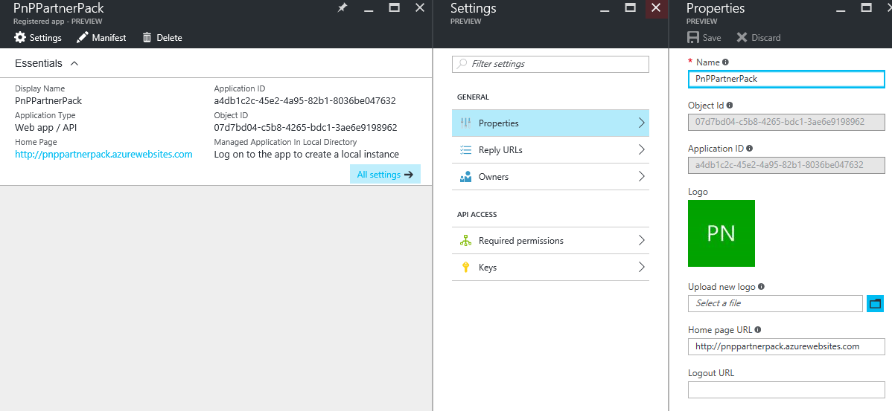

Please make sure you :
- Copy the **Application ID** value as you'll need it later.
- Upload the Application logo (location: OfficeDevPnP.PartnerPack.SiteProvisioning\PnP-O365-App-Icon.png)
- Press save. 

Now, you should go back to the settings blade. Go into **Keys** where you'll create a Client Secret (used for app-only authentication). In order to do that, add a new security key (selecting 1 year, 2 years or never expires for key duration). Press the "Save" button in the lower part of the screen to generate the key value. After saving, you will see the key value. **Copy it in a safe place**, because you will not see it anymore.

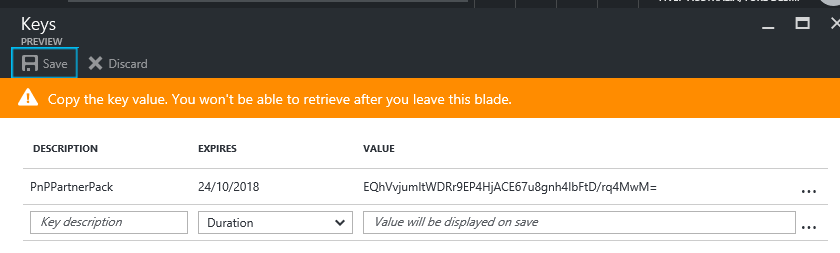


Now click on "Required Permissions", and click on the "Add" button, a new blade will appear.


You need to configure the following permissions:
* Microsoft Graph (**Delegated Permission**)
  * **Read directory data**
  * **Read all users' basic profiles**
  * **Read and write access to user profile**
* Windows Azure Active Directory (**Delegated Permission**)
  * **Sign in and read user profile**
* Office 365 SharePoint Online (**Application Permission**)
  * **Read and write managed metadata**
  * **Have full control of all site collection**

  For further details, see the following figure.

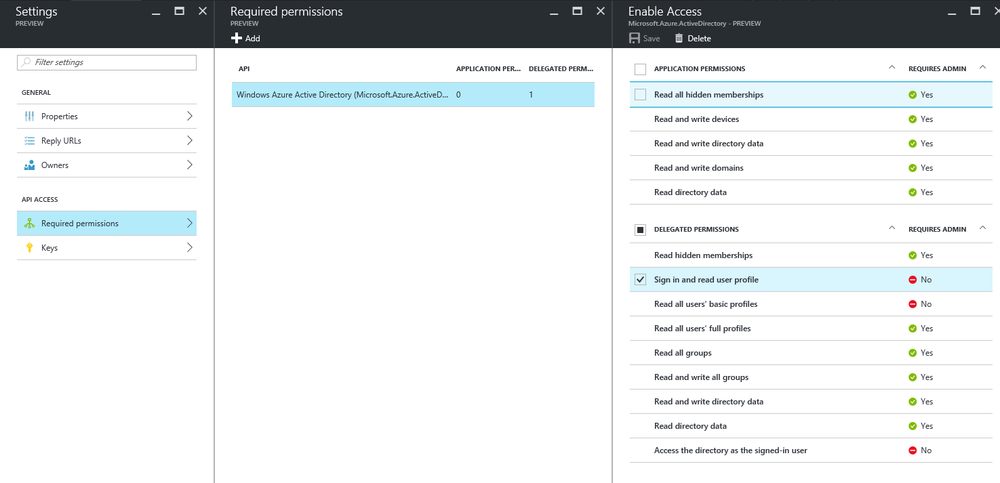

The "Application Permissions" are those granted to the application when running as App Only. The other set of permissions, called "Delegated Permissions", defines the permissions granted to the application when running under a specific user's account delegation (using an app and user access token, from an OAuth 2.0 perspective).

Click the Grant Permission button on the 'Required Permissions' tab, if you want to give non-tenant admin users access to the application.

<!--

-->


<a name="apponlyazuread"></a>
### Update Azure AD Application manifest

You can execute the <a href="../scripts/Get-SelfSignedCertificateInformation.ps1">Get-SelfSignedCertificateInformation.ps1</a> script. This script is available in the 
<a href="../scripts/">Scripts folder</a> of this repository:

 script (which is available under the scripts folder of the PnP Partner Pack):

```PowerShell
.\Get-SelfSignedCertificateInformation.ps1 | clip
```

You will have to provide the path of the .CER file that you created before, when you created the certificate for the AppOnly context configuration.
The command will copy into the clipboard a JSON snippet that you will use in the upcoming steps. Paste the content of the clipboard in a safe place (like a fresh new notepad file).
Notice that the command will also provide the certificate thumbprint needed for configuration later in the document.

Alternatively, start a PowerShell command window, and execute the following instructions:

```PowerShell
$certPath = Read-Host "Enter certificate path (.cer)"
$cert = New-Object System.Security.Cryptography.X509Certificates.X509Certificate2
$cert.Import($certPath)
$rawCert = $cert.GetRawCertData()
$base64Cert = [System.Convert]::ToBase64String($rawCert)
$rawCertHash = $cert.GetCertHash()
$base64CertHash = [System.Convert]::ToBase64String($rawCertHash)
$KeyId = [System.Guid]::NewGuid().ToString()

$keyCredentials = 
'"keyCredentials": [
    {
      "customKeyIdentifier": "'+ $base64CertHash + '",
      "keyId": "' + $KeyId + '",
      "type": "AsymmetricX509Cert",
      "usage": "Verify",
      "value":  "' + $base64Cert + '"
     }
  ],'
$keyCredentials

Write-Host "Certificate Thumbprint:" $cert.Thumbprint
```

Copy the output value into a text file as you will have to use it soon.

Go back to the Azure AD Application that you created in the previous step and click the **"Manifest"** button at the top of the blade, then click **Edit'**. This is how your screen should look like now:

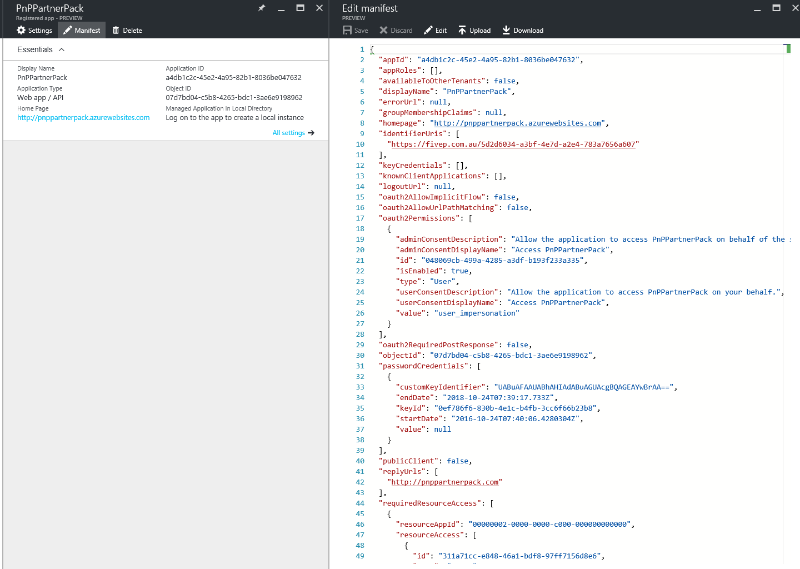

Search for the **keyCredentials** property and replace it with the snippet you generated before, this will be similar to:

```JSON
  "keyCredentials": [
    {
      "customKeyIdentifier": "<$base64CertHash>",
      "keyId": "<$KeyId>",
      "type": "AsymmetricX509Cert",
      "usage": "Verify",
      "value":  "<$base64Cert>"
     }
  ],
```

Click **Save** when you complete this step.

>For further details about running App Only applications, you can read <a href="http://blogs.msdn.com/b/richard_dizeregas_blog/archive/2015/05/03/performing-app-only-operations-on-sharepoint-online-through-azure-ad.aspx">the following article
>from Richard diZerega</a>.


<a name="sitecollection"></a>
### Infrastructural Site Collection provisioning
It is now time to create an infrastructural Site Collection in your Office 365 tenant. You can do that using the SharePoint Online Admin Center, or you can use below PowerShell script that uses the wonderful PnP PowerShell extensions made by <a href="https://twitter.com/erwinvanhunen">Erwin</a> and maintained by the whole community, which are available <a href="https://github.com/OfficeDev/PnP-PowerShell">here</a>.

```PowerShell
Connect-PnPOnline "https://[tenant]-admin.sharepoint.com/"

New-PnPTenantSite -Title "PnP Partner Pack - Infrastructural Site" -Url "https://[tenant].sharepoint.com/sites/PnP-Partner-Pack-Infrastructure" -Owner "[admin_account]" -Lcid 1033 -Template "STS#0" -TimeZone 4 -RemoveDeletedSite
```

Once the **Infrastructural site collection** is available you can continue with configuring this site collection. 

#### Recommended approach
The recommended approach here is to use the <a href="../scripts/Provision-InfrastructureSiteArtifacts.ps1">**Provision-InfrastructureSiteArtifacts.ps1**</a> PowerShell script file that is available in the <a href="../scripts/">Scripts folder</a> of this repository. This script will do everything for you, including replacing any parameter within the provisioning templates, in order to make it easier for you to setup the entire solution.
 
This PowerShell script requires some input arguments, which are:
* **InfrastructureSiteUrl**: the URL of the SharePoint Online infrastructural Site Collection that you want to create
* **AzureWebSiteUrl**: the URL of the Azure Web App Site that you will create later in this setup guide (important: it must end with '/')
* **Credentials**: Optionally provide the credentials to use in order to authenticate against the target Microsoft Office 365 tenant. If you don't pass them the script will ask them at run time  

```PowerShell
.\Provision-InfrastructureSiteArtifacts.ps1 -InfrastructureSiteUrl https://[tenant].sharepoint.com/sites/pnp-partner-pack-infrastructure -AzureWebSiteUrl https://[PnP Azure web app].azurewebsites.net/
```

#### Manual approach
Above **Provision-InfrastructureSiteArtifacts.ps1** script did all the work for you...if you however want to manually do this configuration then please follow these instructions: just after having created the site, you will have to provision some artifacts to hold infrastructural information. In order to do that, you simply need to apply three PnP Provisioning Templates that are available in the PnP Partner Pack repository on GitHub.

Here follows an excerpt of the PowerShell script to provision these artifacts:

```PowerShell
Connect-PnPOnline "https://[tenant].sharepoint.com/sites/PnP-Partner-Pack-Infrastructure"

Apply-PnPProvisioningTemplate -Path "[Partner-Pack-Source-Code-Folder]\OfficeDevPnP.PartnerPack.SiteProvisioning\OfficeDevPnP.PartnerPack.SiteProvisioning\Templates\Infrastructure\PnP-Partner-Pack-Infrastructure-Jobs.xml"
Apply-PnPProvisioningTemplate -Path "[Partner-Pack-Source-Code-Folder]\OfficeDevPnP.PartnerPack.SiteProvisioning\OfficeDevPnP.PartnerPack.SiteProvisioning\Templates\Infrastructure\PnP-Partner-Pack-Infrastructure-Templates.xml"
Apply-PnPProvisioningTemplate -Path "[Partner-Pack-Source-Code-Folder]\OfficeDevPnP.PartnerPack.SiteProvisioning\OfficeDevPnP.PartnerPack.SiteProvisioning\Templates\PnP-Partner-Pack-Infrastructure-Contents.xml"
```

> Notice that the previous code excerpts are just examples, to show you how you should invoke the cmdlets manually. 

These Provisioning Templates will create a couple of libraries, including some infrastructural 
content types, that will store the Provisioning Templates, as well as the Provisioning Jobs leveraged by the infrastructure of PnP Partner Pack. You will find two libraries (PnPProvisioningJobs and PnPProvisioningTemplates), which will be used to store infrastructural data.

To have a look at these libraries, you can open links like the following ones:
* https://[tenant].sharepoint.com/sites/PnP-Partner-Pack-Infrastructure/PnPProvisioningJobs
* https://[tenant].sharepoint.com/sites/PnP-Partner-Pack-Infrastructure/PnPProvisioningTemplates

In the latter library, you will already find some Provisioning Templates, organized in sub-folders. You will use them later in this setup guide.

<a name="configconfigs"></a>
### Partner Pack solution configuration
Once you've completed the previous steps you'll have all the information needed to prepare the publishing of the PnP components to the Azure App Service. Before you can publish the PnP Partner Pack to the Azure App Service you need to configure all the web.config and app.config files. The recommended approach here is to use the <a href="../scripts/Configure-Configs.ps1">Configure-Configs.ps1</a> script. This script is available in the 
<a href="../scripts/">Scripts folder</a> of this repository and requires following input:

* **AzureStorageAccountName**: the name of the storage account that will be used the infrastructural services and by the job
* **AzureStoragePrimaryAccessKey**: the access key to consume the Azure Storage Account
* **ClientId**: the OAuth ClientID registered in Azure AD for the PnP Partner Pack application 
* **ClientSecret**: the OAuth Client Secret registered in Azure AD for the PnP Partner Pack application 
* **ADTenant**: the tenant name of the target Microsoft Office 365 tenant (something like: tenant.onmicrosoft.com)
* **CertificateThumbprint**: the thumbprint of the X.509 certificate that will be used for App-Only authentication
* **InfrastructureSiteUrl**: the URL of the SharePoint Online infrastructural Site Collection for the PnP Partner Pack 

Below you can see a sample of this script execution:
```PowerShell
.\Configure-Configs.ps1 -AzureStorageAccountName [storage account] -AzureStoragePrimaryAccessKey [key] -ClientId [clientid] -ClientSecret [secret] -ADTenant [tenant].onmicrosoft.com -CertificateThumbprint <thumbprint> -InfrastructureSiteUrl https://[tenant].sharepoint.com/sites/pnp-partner-pack-infrastructure
```

Alternatively, you can manually open the web.config file of the Web Application called OfficeDevPnP.PartnerPack.SiteProvisioning and available on GitHub at <a href="../OfficeDevPnP.PartnerPack.SiteProvisioning/OfficeDevPnP.PartnerPack.SiteProvisioning">this URL</a>.

In case you like to configure the application manually, edit the following sections:

```XML
  <connectionStrings>
    <add name="DefaultConnection" connectionString="Data Source=(LocalDb)\MSSQLLocalDB;AttachDbFilename=|DataDirectory|\aspnet-OfficeDevPnP.PartnerPack.SiteProvisioning-20151015100837.mdf;Initial Catalog=aspnet-OfficeDevPnP.PartnerPack.SiteProvisioning-20151015100837;Integrated Security=True" providerName="System.Data.SqlClient" />
    <add name="AzureWebJobsStorage" connectionString="DefaultEndpointsProtocol=https;AccountName=[Storage Account Name];AccountKey=[Storage Account Primary Access Key]"/>
  </connectionStrings>
  <appSettings>

    <!-- Azure AD Settings -->
    <add key="ida:ClientId" value="[Your App Client ID]" />
    <add key="ida:AADInstance" value="https://login.microsoftonline.com/" />
    <add key="ida:ClientSecret" value="[Your App Client Secret]" />

  </appSettings>

  <!-- PnP Partner Pack Settings -->
  <PnPPartnerPackConfiguration xmlns="http://schemas.dev.office.com/PnP/2015/10/PnPPartnerPackConfiguration">
    <GeneralSettings defaultSiteTemplate="STS#0"
                     Title="PnP Partner Pack"
                     LogoUrl="/AppIcon.png">
      <WelcomeMessage>
        <![CDATA[
          Welcome to the PnP Partner Pack, which is a project managed by the <a href="http://aka.ms/OfficeDevPnP" target="_blank">Office 365 Developers Patterns &amp; Practices</a> team!<br />
          This is a sample solution, including source code, that illustrates to the partners' ecosystem and customers how to get started truly on the transformation, and with typical SP add-in model implementations.<br />
          Here you can find samples about how to manage the provisioning of Site Collection or Sub Sites, applying one or more provisioning templates.<br />
          The provisioning is based on the new Remote Provisioning technique, by leveraging the PnP Provisioning Engine.<br />
          Let's play with this sample solution and enjoy the new Add-In Model for Microsoft SharePoint andd Microsoft Office 365.
        ]]>
      </WelcomeMessage>
      <FooterMessage>
        <![CDATA[
          <p>
            &copy; <a href="http://aka.ms/OfficeDevPnP">Office 365 Developers Patterns &amp; Practices</a>
          </p>
        ]]>
      </FooterMessage>
    </GeneralSettings>

    <TenantSettings tenant="[tenant].onmicrosoft.com" appOnlyCertificateThumbprint="[X.509 Self-Signed Certificate Thumbprint]" infrastructureSiteUrl="https://[tenant].sharepoint.com/sites/PnP-Partner-Pack-Infrastructure/" />

    <ProvisioningRepository name="SharePointProvisioningRepository" type="OfficeDevPnP.PartnerPack.Infrastructure.SharePoint.SharePointProvisioningRepository, OfficeDevPnP.PartnerPack.Infrastructure" />

    <TemplatesProviders>
      <TemplatesProvider name="TenantGlobal" enabled="true" type="OfficeDevPnP.PartnerPack.Infrastructure.TemplatesProviders.SharePointGlobalTemplatesProvider, OfficeDevPnP.PartnerPack.Infrastructure" />
      <TemplatesProvider name="SiteCollectionLocal" enabled="true" type="OfficeDevPnP.PartnerPack.Infrastructure.TemplatesProviders.SharePointLocalTemplatesProvider, OfficeDevPnP.PartnerPack.Infrastructure" />
      <TemplatesProvider name="TemplatesGallery" enabled="true" type="OfficeDevPnP.PartnerPack.Infrastructure.TemplatesProviders.PnPTemplatesGalleryProvider, OfficeDevPnP.PartnerPack.Infrastructure">
        <Configuration>
          <gallery url="https://templates-gallery.sharepointpnp.com/" />
        </Configuration>
      </TemplatesProvider>
    </TemplatesProviders>

    <ProvisioningJobs>
      <JobHandlers>
        <JobHandler name="ProvisioningTemplateJobHandler" type="OfficeDevPnP.PartnerPack.Infrastructure.Jobs.Handlers.ProvisioningTemplateJobHandler, OfficeDevPnP.PartnerPack.Infrastructure" />
        <JobHandler name="SiteCollectionProvisioningJobHandler" type="OfficeDevPnP.PartnerPack.Infrastructure.Jobs.Handlers.SiteCollectionProvisioningJobHandler, OfficeDevPnP.PartnerPack.Infrastructure" />
        <JobHandler name="SubSiteProvisioningJobHandler" type="OfficeDevPnP.PartnerPack.Infrastructure.Jobs.Handlers.SubSiteProvisioningJobHandler, OfficeDevPnP.PartnerPack.Infrastructure" />
        <JobHandler name="BrandingJobHandler" type="OfficeDevPnP.PartnerPack.Infrastructure.Jobs.Handlers.BrandingJobHandler, OfficeDevPnP.PartnerPack.Infrastructure" />
        <JobHandler name="SiteCollectionsBatchJobHandler" type="OfficeDevPnP.PartnerPack.Infrastructure.Jobs.Handlers.SiteCollectionsBatchJobHandler, OfficeDevPnP.PartnerPack.Infrastructure" />
        <JobHandler name="RefreshSitesJobHandler" type="OfficeDevPnP.PartnerPack.Infrastructure.Jobs.Handlers.RefreshSitesJobHandler, OfficeDevPnP.PartnerPack.Infrastructure" />
      </JobHandlers>
      <JobTypes>
        <JobType handler="ProvisioningTemplateJobHandler" executionModel="Scheduled" type="OfficeDevPnP.PartnerPack.Infrastructure.Jobs.GetProvisioningTemplateJob" />
        <JobType handler="ProvisioningTemplateJobHandler" executionModel="Continous" type="OfficeDevPnP.PartnerPack.Infrastructure.Jobs.ApplyProvisioningTemplateJob" />
        <JobType handler="SiteCollectionProvisioningJobHandler" executionModel="Scheduled" type="OfficeDevPnP.PartnerPack.Infrastructure.Jobs.SiteCollectionProvisioningJob" />
        <JobType handler="SubSiteProvisioningJobHandler" executionModel="Continous" type="OfficeDevPnP.PartnerPack.Infrastructure.Jobs.SubSiteProvisioningJob" />
        <JobType handler="BrandingJobHandler" executionModel="Scheduled" type="OfficeDevPnP.PartnerPack.Infrastructure.Jobs.BrandingJob" />
        <JobType handler="SiteCollectionsBatchJobHandler" executionModel="Scheduled" type="OfficeDevPnP.PartnerPack.Infrastructure.Jobs.SiteCollectionsBatchJob" />
        <JobType handler="RefreshSitesJobHandler" executionModel="Scheduled" type="OfficeDevPnP.PartnerPack.Infrastructure.Jobs.RefreshSitesJob" />
      </JobTypes>
    </ProvisioningJobs>

  </PnPPartnerPackConfiguration>

```

All the values surrounded by [name] have to be replaced with the corresponding values, which you got in one or more of the previous setup steps. 

Upload the Web application to the target Azure App Service. You can use any of the available techniques for doing that (GitHub repository, FTP, Visual Studio Publish, etc.). 

**Important:**
When you publish the web application using Microsoft Visual Studio, remember to **uncheck **the option "Enable Organizational Authentication". If you leave this selected you might face authentication issues when running the PnP Partner Pack.

Notice that the web application uses a token cache for ADAL tokens, which are used when accessing the Microsoft Graph API. The token cache provided is based on the web application session. Thus, it is not a scalable solution and it cannot be used with multiple instances of the web app. However, you can configure a session based on an external persistence provider, like for example the <a href="https://azure.microsoft.com/en-us/documentation/articles/cache-asp.net-session-state-provider/">Azure Redis Cache</a>, or you can define a token cache handler of your own, using a backend database or whatever else. For further details about ADAL and the token cache, you can read the <a href="./Architecture-and-Implementation.md">architectural document</a> related to the PnP Partner Pack.
 
You are now ready to play with your Office 365 Application. Simply open an Office 365 user session, click on the App Launcher and select the "New" command.


From there, you can directly start the PnP Partner Pack web application, by clicking on the app icon, or you can even pin the app into the App Launcher.


You will see the Home Page of the PnP Partner Pack.


<a name="webjobs"></a>
### Azure Web Jobs provisioning
In order to automate the provisioning processes, as well as the governance rules enforcement you have to provision some Azure Web Jobs. 

Below is the complete list of jobs, the **ScheduledJob** and **ContinousJob** are mandatory jobs if you want the basic PnP Partner Pack functionality to work. The other jobs are optional:
* **ScheduledJob**: is a Job scheduled (the scheduling is up to you) that creates Site Collections, and applies Provisioning Templates to Sites. This job is available <a href="../OfficeDevPnP.PartnerPack.SiteProvisioning/OfficeDevPnP.PartnerPack.ScheduledJob">here</a>.
* **ContinousJob**: is a continuously running job that creates Sub Sites and extracts Provisioning Templates in near-real-time. This job is available <a href="../OfficeDevPnP.PartnerPack.SiteProvisioning/OfficeDevPnP.PartnerPack.ContinousJob">here</a>.
* **CheckAdminJob**: it is a scheduled Job, which checks that every Site Collection provisioned using the PnP Partner Pack has at least two Site Collection Administrators. 
If the check fails, the job sends and email alert to the unique Site Collection Administrator.
* **ExternalUsersJob**: this scheduled Job checks the status of the External Users for every Site Collection provisioned using the PnP Partner Pack.

Before you can publish the jobs, you will need to configure the App.Config of the jobs, providing almost the same parameters that you configured for the web application and/or the other jobs. If you ran the recommended **Configure-Configs.ps1** previously your app.config files should already be fine. If not you can use the <a href="../scripts/Configure-Configs.ps1">Configure-Configs.ps1</a> PowerShell script file that is available in the <a href="../scripts/">Scripts folder</a> of this repository.

Moreover, you will have to publish them into the Azure App Service. To provision the Governance Jobs (*CheckAdminJob* and *ExternalUsersJob*) you can use the <a href="../scripts/Provision-GovernanceTimerJobs.ps1">Provision-GovernanceTimerJobs.ps1</a> PowerShell script file that is available in the <a href="../scripts/">Scripts folder</a> of this repository.

> For further details about how to publish Azure Web Jobs you can be read the following article: <a href="https://azure.microsoft.com/en-gb/documentation/articles/websites-dotnet-deploy-webjobs/">Deploy WebJobs using Visual Studio</a>.

#### Publishing the **ScheduledJob** using a **minute** schedule (Azure Scheduler)
When you publish a Web Job that requires to be run at a schedule, your web job by default will end up in a free scheduler job collection which only allows to run scheduled jobs at a 1 hour interval or higher. Since site collection creation is handled via the ScheduledJob you might want to have this job running more frequently (e.g. every 5 minutes). Below steps describe how you can convert the created scheduled job collection to a paying version, which allows to schedule jobs at a minute level interval:
* Deploy the **ScheduledJob** at a 1 hour interval. This will allow the job to get properly scheduled
* Go to the [Azure management portal](http://portal.azure.com) (portal.azure.com), click on "Browse >" and select **"Scheduler Job Collections"**
* Select the "WebJobs-[region]" scheduler job collection. This will show the scheduler job collection and it's settings.
    * Select the **"Pricing tier"** and change from "Free" to **"Standard"**
    * Select **"Quotas"** and change the max recurrence setting to **5 Minutes** 
    * Select **"Scheduler Jobs"** and click on the **ScheduledJob**
        * Select **"Schedule"** in the settings and - for example - change the schedule to a 5 minute schedule
        * Select **"Action Settings"** and in the **Optional settings** set the **Authentication settings** to **Basic**
        * Provide the **username** (e.g. $pnp-partner-pack-demo) and **password**: the best option to obtain these values is to download the publishing profile from the Azure App Service and copy the user and password value from that file

Below screenshots show some of the above steps in action:


#### Publishing the **ScheduledJob** using a **minute** schedule (Internal WebJob Scheduler)
Instead of deploying the ScheduledJob to a Schedule Job Collection (Azure Scheduler) you can deploy it directly to the app service you created earlier (Interal WebJob Scheduler) for the PnP Partner Pack web site. The only caveat is that this requires your app service to be configured as Always On (more expensive!). Otherwise the ScheduledJob will stop running after 12 hours.

In the root of the ScheduledJob Visual Studio project, add a JSON file called settings.job. Make sure it is set to 'Copy always' in the file properties. The schedule is specified with a cron expression composed of the following fields: {second} {minute} {hour} {day} {month} {day of the week}. The settings.job for a minute schedule looks like this:  

```JSON
{
  "schedule": "0 * * * * *"
}
```

Also, in the webjob-publish-settings.json file (under Properties in the Visual Studio project) you want to change the runMode from 'OnDemand' to 'Scheduled' and give it at start date. You will end up with a file looking like this:

```JSON
{
  "$schema": "http://schemastore.org/schemas/json/webjob-publish-settings.json",
  "webJobName": "ScheduledJob",
  "startTime": "2016-12-18T00:00:00-08:00",
  "runMode": "Scheduled"
}
```

Finally, deploy the web job from Visual Studio using the 'Publish as Azure WebJob' function.

> For further details about how to use cron expressions with WebJobs you can be read the following article: <a href="http://blog.amitapple.com/post/2015/06/scheduling-azure-webjobs/">Scheduling Azure WebJobs with cron expressions</a>.

 
