# PnP Partner Pack - Manual Setup Guide

##Solution Overview
PnP Partner Pack allows you to extend the out of the box experience of Microsoft Office 365 and 
Microsoft SharePoint Online, by providing the following capabilities:
* Save Site as Provisioning Template feature in Site Settings
* Sub-Site creation  with custom UI and PnP Provisioning Template selection
* Site Collection creation for non-admin users with custom UI and PnP Provisioning Template selection
* My Site Collections personal view
* Responsive Design template for Site Collections
* Custom NavBar and Footer for Site Collections with JavaScript object model
* Sample Timer Jobs (implemented as WebJobs) for Governance rules enforcement

This document is about the **PnP Partner Pack v. 1.1 (February 2016)**.

## Setup Overview
From a deployment perspective the PnP Partner Pack is an Office 365 Application, which 
leverages an Azure Web App with an Azure Web Sites and some Azure Web Jobs.

The application has to be registered in Azure Active Directory and acts against SharePoint
Online using an App Only access token, based on an X.509 self-signed Certificate.

Moreover, it is a requirement to have an Infrastructural Site Collection provisioned in
the target SharePoint Online tenant.

This document outlines the manual setup process, which allows you to leverage the 
PnP Partner Pack in your own environment.

If you already installed the PnP Partner Pack v. 1.0 and you are upgrading it to the
latest version, which currently is v. 1.1, you can read the following 
<a href="./Upgrade-From-v1_0-to-v1_1.md">upgrade guide</a>,
instead of reading this setup guide.

## Requirements
In order to setup the PnP Partner Pack you need:
* A valid Microsoft Office 365 tenant with at least an active subscription
* The PnP PowerShell cmdlets (available here: http://aka.ms/OfficeDevPnPPowerShell) at least of version 2.0.1601.0. To double-check the version of the PnP PowerShell cmdlets, you can invoke the Connect-SPOOnline cmdlet with the -Verbose argument

## Installation Steps
The manual installation requires to accomplish the following steps:
* [Azure Active Directory Application registration, as Office 365 Application](#azuread)
* [Create the self-signed certificate](#createcertificate)
* [App Only certificate configuration in the Azure AD Application](#apponlyazuread)
* [Infrastructural Site Collection provisioning](#sitecollection)
* [Azure Blob Storage creation](#azureblob)
* [Azure Web App provisioning and configuration](#azurewebapp)
* [App Only certificate configuration in the Azure Web App](#apponlywebapp)
* [Azure Web Jobs provisioning](#webjobs)

During the setup guide you will often find two suitable alternatives to gain your goal. The first option will be to use some ready to go PowerShell scripts, which are the suggested path. Alternatively you will find some detailed and manual steps, if you rather prefer to setup everything manually.

<a name="azuread"></a>
###Azure Active Directory Application Registration
First of all, because the PnP Partner Pack is an Office 365 Application, you have to register
it in the Azure Active Directory tenant that is under the cover of your Office 365 tenant.
In order to do that, open the Office 365 Admin Center (https://portal.office.com) using
the account of a user member of the Tenant Global Admins group.

Click on the "Azure AD" link that is available under the ADMIN group in the left-side 
treeview of the Office 365 Admin Center. In the new browser's tab that will be opened you
will find the Microsoft Azure Management Portal. If it is the first time that you access
the Azure Management Portal with your account, you will have to register a new Azure
subscription, providing some information and a credit card for any payment need.
But don't worry, in order to play with Azure AD and to register Office 365 Application you
will not pay anything. In fact, those are free capabilities. 
After having accessed the Azure Management Portal, select the "Active Directory" section,
by clicking on the icon highlighted in the following screenshot:


On the right side of the screen you will se the Azure AD tenant corresponding to your
Office 365 tenant. Click on it to access its configuration, and then select the 
"Applications" tab. See the next figure for further details.

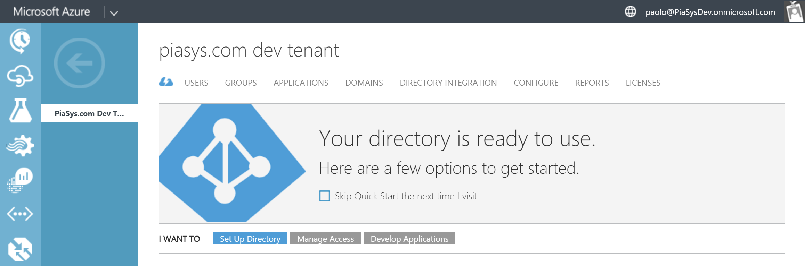

In the "Applications" tab you will find the list of Azure AD applications installed in 
your tenant. Click the "Add" button in the lower part of the screen, select the option
"Add an application my organization is developing".

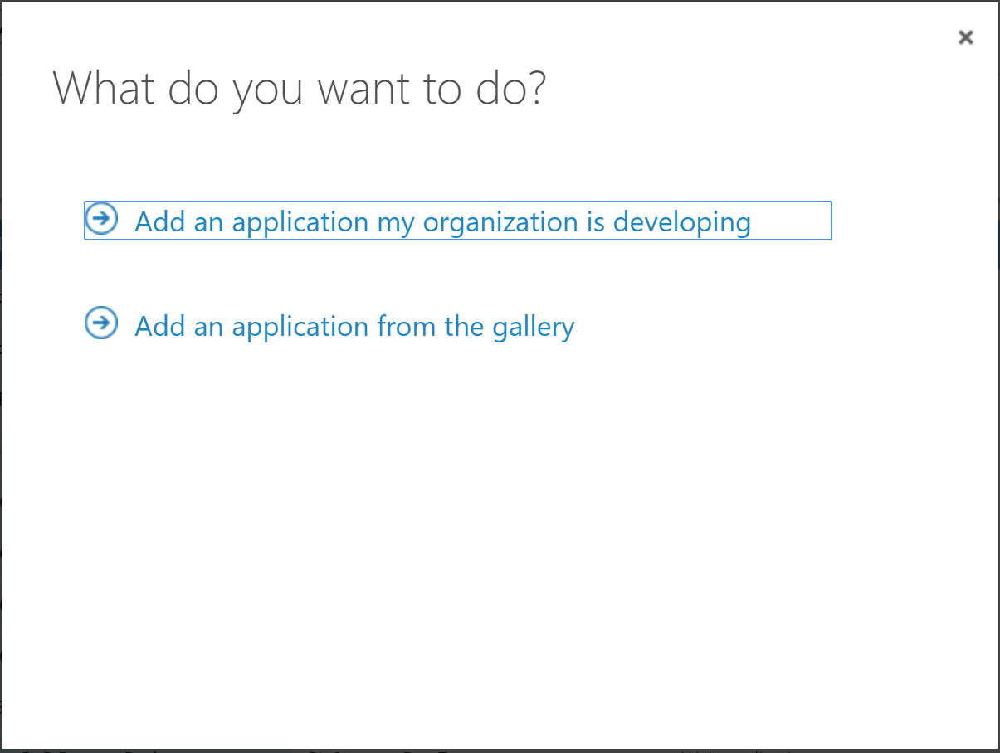

Then, provide a name for your application (we suggest to name it "OfficeDev PnP Partner
Pack"), and select the option "Web application and/or web API".

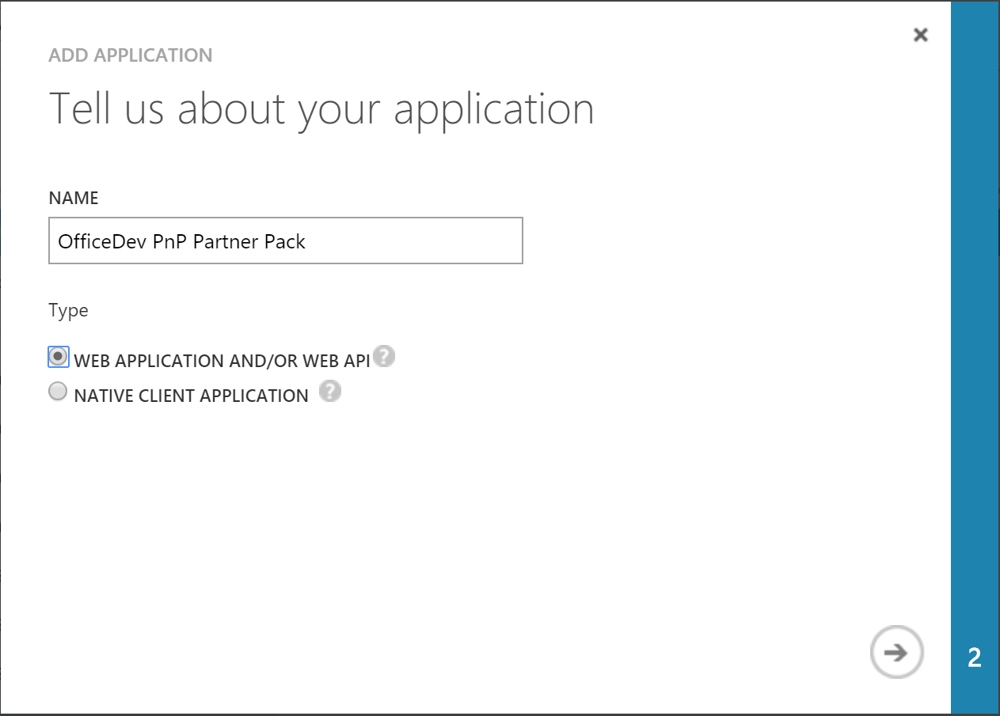

In the following registration step, provide the URL of the Azure Web App that you will
create (in one of the following steps) and define a unique ID, which can be for example
https://yourtenantonmicrosoft.com/OfficeDevPnP.PartnerPack.SiteProvisioning.

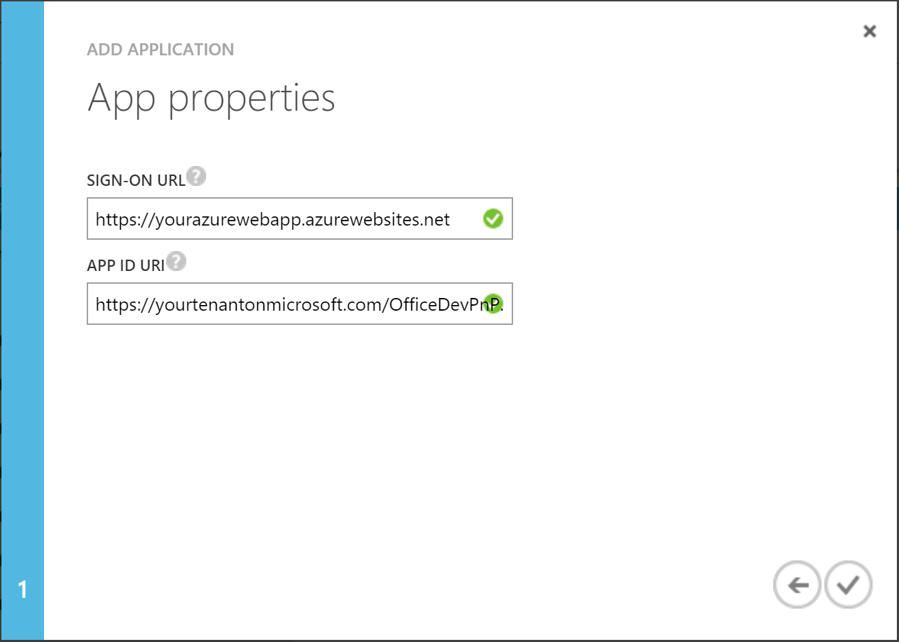

After having created the Azure AD Application, go into the "Configure" tab of the application.
There you can upload the app logo (<a href="https://raw.githubusercontent.com/OfficeDev/PnP-Partner-Pack/dev/OfficeDevPnP.PartnerPack.SiteProvisioning/OfficeDevPnP.PartnerPack.SiteProvisioning/PnP-O365-App-Icon.png">PnP-O365-App-Icon.png</a>),
and you can configure the application security.

First of all, you have to copy the value of the Client ID property. Moreover, you have
to configure a client secret. In order to do that, add a new security key (selecting 1 year
or 2 years for key duration). Press the "Save" button in the lower part of the screen to
generate the key value. After saving, you will see the key value. Copy it in a safe place,
because you will not see it anymore.

**Note:**
Please ensure that the listed reply URL ends with a trailing slash as shown in below screenshot. 

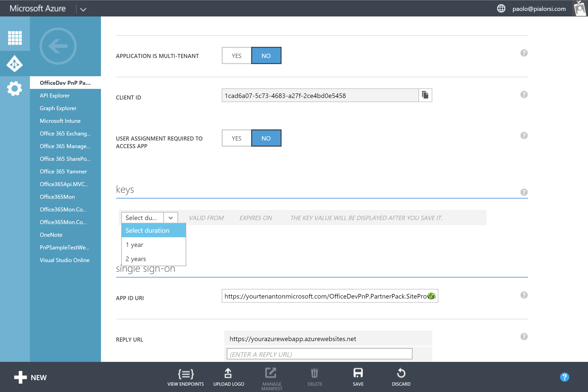

Scroll down a little bit more in the UI and configure the Application permissions, within
the "Permissions to other applications" section, which is illustrated in the following figure.

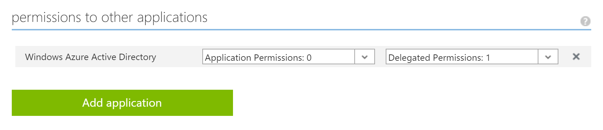

Click the "Add Application" button, a popup screen will appear. Select "Office 365 SharePoint Online"
and "Microsoft Graph", then click the confirmation button. In the main configuration screen you have 
to configure the following application permissions:

* Office 365 SharePoint Online (Application Permission)
  * Have full control of all site collection
  * Read and write managed metadata
* Microsoft Graph (Delegated Permission)
  * Read and write access to user profile

For further details, see the following figure.


The "Application Permissions" are those granted to the application when running as App Only.
The other dropdown of permissions, called "Delegated Permissions", defines the permissions
granted to the application when running under a specific user's account delegation (using
and app and user access token, from an OAuth 2.0 perspective).

<a name="createcertificate"></a>
###Create the self signed certificate
You are now ready to configure the Azure AD Application for invoking SharePoint Online with
an App Only access token. In order to do that, you have to create and configure a self-signed
X.509 certificate, which will be used to authenticate your Application against Azure AD, while
requesting the App Only access token. 

First of all, you have to create the self-signed X.509 Certificate, which can be created 
using the makecert.exe tool that is available in the Windows SDK or through a provided PowerShell script which does not have a dependency to makecert. 

####Using the Create-SelfSignedCertificate PowerShell Script
You can use a provided PowerShell script which does not have a dependency to makecert.exe. The script is called <a href="../scripts/Create-SelfSignedCertificate.ps1">Create-SelfSignedCertificate.ps1</a> and is available in the 
<a href="../scripts/">Scripts folder</a> of this repository.

To create a self signed certificate with this script:

```PowerShell
.\Create-SelfSignedCertificate.ps1 -CommonName "MyCompanyName" -StartDate 2015-10-25 -EndDate 2016-10-25
```

You will be asked to provide a password to encrypt your private key, and both the .PFX file and .CER file will be exported to the current folder.

####Using makecert (alternative manual option)
Alternatively, if you have Microsoft Visual Studio 2013/2015 installed on your enviroment, you already have the makecert tool, as well.
Otherwise, you will have to download from MSDN and to install the Windows SDK for your current
version of Windows Operating System.

The command for creating a new self-signed X.509 certificate is the following one:

```
makecert -r -pe -n "CN=MyCompanyName MyAppName Cert" -b 10/25/2015 -e 10/25/2016 -ss my -len 2048
```

The previous command creates a self-signed certificate with a common name (CN) value of "MyCompanyName MyAppName Cert", a validity
timeframe between 10/25/2015 and 10/25/2016, and a key length of 2048 bit. The certificate will have an exportable private key, 
and will be stored in the personal certificate store of the current user. 

>For further details about the makecert syntax and command line parameters you can read <a href="https://msdn.microsoft.com/en-us/library/windows/desktop/aa386968(v=vs.85).aspx">the following article</a>  on MSDN.

After having created the self-signed X.509 Certificate you have to export it as a .PFX file, which includes the private key value.
In order to do that, run the MMC.EXE command as an Administrator (RunAs Admin) and add the Certificates MMC snap-in, targeting the personal store of the current user.
In the Current User's Personal folder of Certificates, select the just created certificate, right click on it and select the "Export" functionality.
Select to export the private key into a .PFX file. Provide a password to protect the private key of the certificate.
Repeat the same process as before, but this time export the certificate as a .CER file, which does not include the private key value.

<a name="apponlyazuread"></a>
### Configure the certificate in the Azure AD application manifest
You can execute 

```PowerShell
Get-SPOAzureADManifestKeyCredentials -CertPath <path to your .cer file> | clip
```

which will generate the required snippet and copy it to the clipboard.

Alternatively, start a PowerShell command window, and execute the following instructions:

```PowerShell
$certPath = Read-Host "Enter certificate path (.cer)"
$cert = New-Object System.Security.Cryptography.X509Certificates.X509Certificate2
$cert.Import($certPath)
$rawCert = $cert.GetRawCertData()
$base64Cert = [System.Convert]::ToBase64String($rawCert)
$rawCertHash = $cert.GetCertHash()
$base64CertHash = [System.Convert]::ToBase64String($rawCertHash)
$KeyId = [System.Guid]::NewGuid().ToString()

$keyCredentials = 
'"keyCredentials": [
    {
      "customKeyIdentifier": "'+ $base64CertHash + '",
      "keyId": "' + $KeyId + '",
      "type": "AsymmetricX509Cert",
      "usage": "Verify",
      "value":  "' + $base64Cert + '"
     }
  ],'
$keyCredentials

Write-Host "Certificate Thumbprint:" $cert.Thumbprint
```

Copy the output value into a text file, you will use it pretty soon.


Go back to the Azure AD Application that you created in the previous step and select the
"Manage Manifest" button in the lower area of the screen, then select the "Download Manifest" 
option in order to download the application manifest as a JSON file.

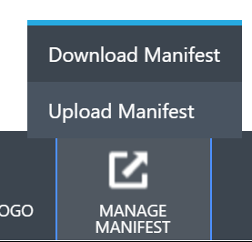

Open the just downloaded file using any text editor, search for the *keyCredentials* property and replace 
it with the snippet you generated above by either running the PowerShell script or the Get-SPOAzureADManifestKeyCredentials cmdlet.

```JSON
  "keyCredentials": [
    {
      "customKeyIdentifier": "<$base64CertHash>",
      "keyId": "<$KeyId>",
      "type": "AsymmetricX509Cert",
      "usage": "Verify",
      "value":  "<$base64Cert>"
     }
  ],
```

You can directly use the output of the previous PowerShell script, excluding the value of the certificate thumbprint.
Save the updated manifest and upload it back to Azure AD, by using the "Upload Manifest" functionality.

>For further details about running App Only applications, you can read <a href="http://blogs.msdn.com/b/richard_dizeregas_blog/archive/2015/05/03/performing-app-only-operations-on-sharepoint-online-through-azure-ad.aspx">the following article
>from Richard diZerega</a>.

<a name="sitecollection"></a>
###Infrastructural Site Collection provisioning
It is now time to create an infrastructural Site Collection in your Office 365 tenant. You
can do that using the SharePoint Online Admin Center, or you can use a PowerShell script.

The 
<a href="../scripts/Provision-InfrastructureSiteArtifacts.ps1">Provision-InfrastructureSiteArtifacts.ps1</a> PowerShell script file
that is available in the 
<a href="../scripts/">Scripts folder</a> of this repository will do everything for you, including replacing
any parameter within the provisioning templates, in order to make it easier for you to setup the entire solution. 
This PowerShell script requires some input arguments, which are:
* InfrastructureSiteUrl: the URL of the SharePoint Online infrastructural Site Collection that you want to create
* AzureWebSiteUrl: the URL of the Azure Web App Site that you will create later in this setup guide
* Credentials: the credentials to use in order to authenticate against the target Microsoft Office 365 tenant 

Alternatively, here you can see a sample excerpt of a PowerShell script that uses the wonderful PnP
PowerShell extensions made by <a href="https://twitter.com/erwinvanhunen">Erwin</a> and maintained by the whole community, which are available <a href="https://github.com/OfficeDev/PnP-PowerShell">here</a>.

```PowerShell
Connect-SPOnline "https://[tenant]-admin.sharepoint.com/"

New-SPOTenantSite -Title "PnP Partner Pack - Infrastructural Site" -Url "https://[tenant].sharepoint.com/sites/PnP-Partner-Pack-Infrastructure" -Owner "[admin_account]" -Lcid 1033 -Template "STS#0" -TimeZone 4 -RemoveDeletedSite
```

Of course, you can call the Site Collection with whatever name and URL you like.
Just after having created the site, you will have to provision some artifacts to hold
infrastructural information. In order to do that, you simply need to apply three PnP
Provisioning Templates that are available in the PnP Partner Pack repository on GitHub.
Here follows an excerpt of the PowerShell script to provision these artifacts:

```PowerShell
Connect-SPOnline "https://[tenant].sharepoint.com/sites/PnP-Partner-Pack-Infrastructure"

Apply-SPOProvisioningTemplate -Path "[Partner-Pack-Source-Code-Folder]\OfficeDevPnP.PartnerPack.SiteProvisioning\OfficeDevPnP.PartnerPack.SiteProvisioning\Templates\Infrastructure\PnP-Partner-Pack-Infrastructure-Jobs.xml"
Apply-SPOProvisioningTemplate -Path "[Partner-Pack-Source-Code-Folder]\OfficeDevPnP.PartnerPack.SiteProvisioning\OfficeDevPnP.PartnerPack.SiteProvisioning\Templates\Infrastructure\PnP-Partner-Pack-Infrastructure-Templates.xml"
Apply-SPOProvisioningTemplate -Path "[Partner-Pack-Source-Code-Folder]\OfficeDevPnP.PartnerPack.SiteProvisioning\OfficeDevPnP.PartnerPack.SiteProvisioning\Templates\PnP-Partner-Pack-Infrastructure-Contents.xml"
```

These Provisioning Templates will create a couple of libraries, including some infrastructural 
content types, that will store the Provisioning Templates, as well as the Provisioning Jobs
leveraged by the infrastructure of PnP Partner Pack. You will find two libraries (PnPProvisioningJobs
and PnPProvisioningTemplates), hidden from the UI and used to store infrastructural data.

To have a look at these libraries, you can open links like the following ones:
* https://[tenant].sharepoint.com/sites/PnP-Partner-Pack-Infrastructure/PnPProvisioningJobs
* https://[tenant].sharepoint.com/sites/PnP-Partner-Pack-Infrastructure/PnPProvisioningTemplates

In the latter library, you will find already uploaded a bunch of Provisioning Templates, 
organized in sub-folders. You will use them later in this setup guide.

> Notice that the previous code excerpts are just examples, to show you how you should invoke the
cmdlets manually. 

<a name="azureblob"></a>
###Azure Blob Storage configuration
To handle some asynchronous tasks, the PnP Partner Pack uses an Azure Blob Storage service
to queue items. Thus, you will need to configure an Azure Blob Storage account.

Open the Microsoft Azure Management Portal, with a valid Microsoft Azure 
subscription, and create a new Azure Blob Storage account. For example, you can call
the Azure Blob Storage account with a name like pnppartnerpack[tenant], or whatever else
you like. After having created the Azure Blob Storage account, open the "Manage Access Keys"
popup screen and copy the values of "Storage Account Name", and "Primary Access Key".

<a name="azurewebapp"></a>
###Azure Web App provisioning and configuration
You will also need to provision an Azure Web App that will host both the Azure Web Site for
the PnP Partner Pack main web application, and the various Web Jobs under the cover of the
PnP Partner Pack.

Back to the Microsoft Azure Management Portal, with a valid Microsoft Azure 
subscription, create a new Azure Web App. Call it with whatever name you like. For 
example, you can call it pnp-partner-pack-[tenant].azurewebsites.net. See the next figure
for a sample configuration.
 
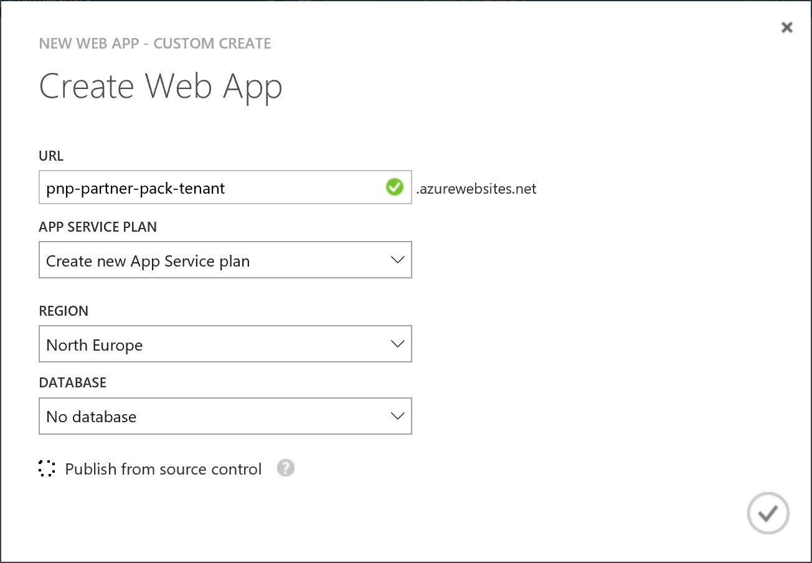

You can configure the web.config file of the web application by using the
<a href="../scripts/Configure-Configs.ps1">Configure-Configs.ps1</a> PowerShell script file
that is available in the 
<a href="../scripts/">Scripts folder</a> of this repository.
This PowerShell script requires some input arguments, which are:
* AzureStorageAccountName: the name of the storage account that will be used the infrastructural services and by the job
* AzureStoragePrimaryAccessKey: the access key to consume the Azure Storage Account
* ClientId: the OAuth ClientID registered in Azure AD for the PnP Partner Pack application 
* ClientSecret: the OAuth Client Secret registered in Azure AD for the PnP Partner Pack application 
* ADTenant: the tenant name of the target Microsoft Office 365 tenant (something like: tenant.onmicrosoft.com)
* CertificateThumbprint: the thumbprint of the X.509 certificate that will be used for App-Only authentication
* InfrastructureSiteUrl: the URL of the SharePoint Online infrastructural Site Collection for the PnP Partner Pack 


Alternatively, yoy can manually open the web.config file of the Web Application called OfficeDevPnP.PartnerPack.SiteProvisioning and
available on GitHub at <a href="../OfficeDevPnP.PartnerPack.SiteProvisioning/OfficeDevPnP.PartnerPack.SiteProvisioning">this URL</a>.

In case you like to configure the application manually, edit the following sections:

```XML
  <connectionStrings>
    <add name="DefaultConnection" connectionString="Data Source=(LocalDb)\MSSQLLocalDB;AttachDbFilename=|DataDirectory|\aspnet-OfficeDevPnP.PartnerPack.SiteProvisioning-20151015100837.mdf;Initial Catalog=aspnet-OfficeDevPnP.PartnerPack.SiteProvisioning-20151015100837;Integrated Security=True" providerName="System.Data.SqlClient" />
    <add name="AzureWebJobsStorage" connectionString="DefaultEndpointsProtocol=https;AccountName=[Storage Account Name];AccountKey=[Storage Account Primary Access Key]"/>
  </connectionStrings>
  <appSettings>

    <!-- Azure AD Settings -->
    <add key="ida:ClientId" value="[Your App Client ID]" />
    <add key="ida:AADInstance" value="https://login.microsoftonline.com/" />
    <add key="ida:ClientSecret" value="[Your App Client Secret]" />

  </appSettings>

  <!-- PnP Partner Pack Settings -->
  <PnPPartnerPackConfiguration xmlns="http://schemas.dev.office.com/PnP/2015/10/PnPPartnerPackConfiguration">
    <GeneralSettings defaultSiteTemplate="STS#0"
                     Title="PnP Partner Pack"
                     LogoUrl="/AppIcon.png">
      <WelcomeMessage>
        <![CDATA[
          Welcome to the PnP Partner Pack, which is a project managed by the <a href="http://aka.ms/OfficeDevPnP" target="_blank">Office 365 Developers Patterns &amp; Practices</a> team!<br />
          This is a sample solution, including source code, that illustrates to the partners' ecosystem and customers how to get started truly on the transformation, and with typical SP add-in model implementations.<br />
          Here you can find samples about how to manage the provisioning of Site Collection or Sub Sites, applying one or more provisioning templates.<br />
          The provisioning is based on the new Remote Provisioning technique, by leveraging the PnP Provisioning Engine.<br />
          Let's play with this sample solution and enjoy the new Add-In Model for Microsoft SharePoint andd Microsoft Office 365.
        ]]>
      </WelcomeMessage>
      <FooterMessage>
        <![CDATA[
          <p>
            &copy; <a href="http://aka.ms/OfficeDevPnP">Office 365 Developers Patterns &amp; Practices</a>
          </p>
        ]]>
      </FooterMessage>
    </GeneralSettings>

    <TenantSettings tenant="[tenant].onmicrosoft.com" appOnlyCertificateThumbprint="[X.509 Self-Signed Certificate Thumbprint]" infrastructureSiteUrl="https://[tenant].sharepoint.com/sites/PnP-Partner-Pack-Infrastructure/" />

    <ProvisioningRepository name="SharePointProvisioningRepository" type="OfficeDevPnP.PartnerPack.Infrastructure.SharePoint.SharePointProvisioningRepository, OfficeDevPnP.PartnerPack.Infrastructure" />

    <ProvisioningJobs>
      <JobHandlers>
        <JobHandler name="ProvisioningTemplateJobHandler" type="OfficeDevPnP.PartnerPack.Infrastructure.Jobs.Handlers.ProvisioningTemplateJobHandler, OfficeDevPnP.PartnerPack.Infrastructure" />
        <JobHandler name="SiteCollectionProvisioningJobHandler" type="OfficeDevPnP.PartnerPack.Infrastructure.Jobs.Handlers.SiteCollectionProvisioningJobHandler, OfficeDevPnP.PartnerPack.Infrastructure" />
        <JobHandler name="SubSiteProvisioningJobHandler" type="OfficeDevPnP.PartnerPack.Infrastructure.Jobs.Handlers.SubSiteProvisioningJobHandler, OfficeDevPnP.PartnerPack.Infrastructure" />
      </JobHandlers>
      <JobTypes>
        <JobType handler="ProvisioningTemplateJobHandler" executionModel="Scheduled" type="OfficeDevPnP.PartnerPack.Infrastructure.Jobs.GetProvisioningTemplateJob" />
        <JobType handler="ProvisioningTemplateJobHandler" executionModel="Continous" type="OfficeDevPnP.PartnerPack.Infrastructure.Jobs.ApplyProvisioningTemplateJob" />
        <JobType handler="SiteCollectionProvisioningJobHandler" executionModel="Scheduled" type="OfficeDevPnP.PartnerPack.Infrastructure.Jobs.SiteCollectionProvisioningJob" />
        <JobType handler="SubSiteProvisioningJobHandler" executionModel="Continous" type="OfficeDevPnP.PartnerPack.Infrastructure.Jobs.SubSiteProvisioningJob" />
      </JobTypes>
    </ProvisioningJobs>

  </PnPPartnerPackConfiguration>

```

All the values surrounded by [name] have to be replaced with the corresponding values,
which you got in one or more of the previous setup steps.

Upload the Azure Web App to the target repository. You can use any of the available
techniques for doing that (GitHub repository, FTP, Visual Studio Publish, etc.). When you
publish the web application, remember to uncheck the option "Enable Organizational Authentication".

Notice that the web application uses a token cache for ADAL tokens, which are used when accessing 
the Microsoft Graph API. The token cache provided is based on the web application
session. Thus, it is not a scalable solution and it cannot be used with multiple instances of the web app.
However, you can configure a session based on an external persistence provider, like for example the
<a href="https://azure.microsoft.com/en-us/documentation/articles/cache-asp.net-session-state-provider/">Azure Redis Cache</a>,
or you can define a token cache handler of your own, using a backend database or
whatever else. For further details about ADAL and the token cache, you can read the
<a href="./Architecture-and-Implementation.md">architectural document</a> related to the PnP Partner Pack.
 
<a name="apponlywebapp"></a>
###App Only certificate configuration in the Azure Web App
Once you have created and configured the Azure Web App, open the "Scale" tab and change the pricing tier 
at least to level "BASIC". For further details, see the next figure.

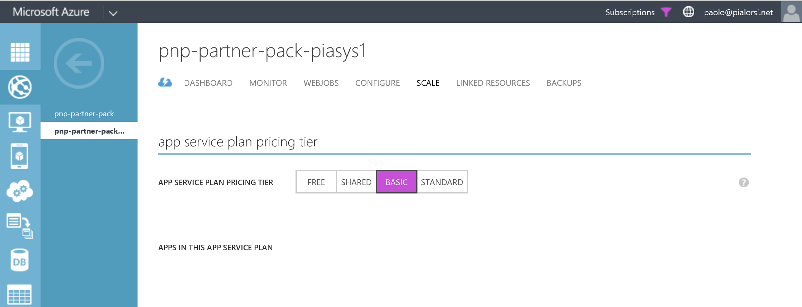

You need at least the "BASIC" pricing plan, because you will need to upload the .PFX file
of the self-signed certificate to create the App Only context, and the "BASIC" level is 
the minimum level that allows management of custom X.509 certificates. Thus, go into the
"Configuration" tab and add a new X.509 certificate to the Azure Web App, through the proper
configuration section, which is highlighted in the following figure.

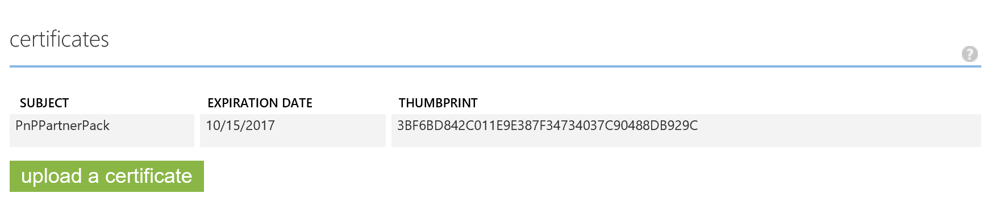

After that, scroll a little bit to the "App Settings" section. There, you will have to configure
a setting called *WEBSITE_LOAD_CERTIFICATES* with a value of ***. In the following figure
you can see a sample configuration.

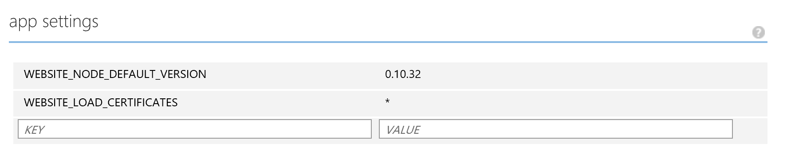

This last setting allows the Azure Web App to access the service account's personal certificate
store to read the App Only X.509 certificate.
You are now ready to play with your Office 365 Application. Simply open an Office 365 user session,
click on the App Launcher and select the "My Apps" command.

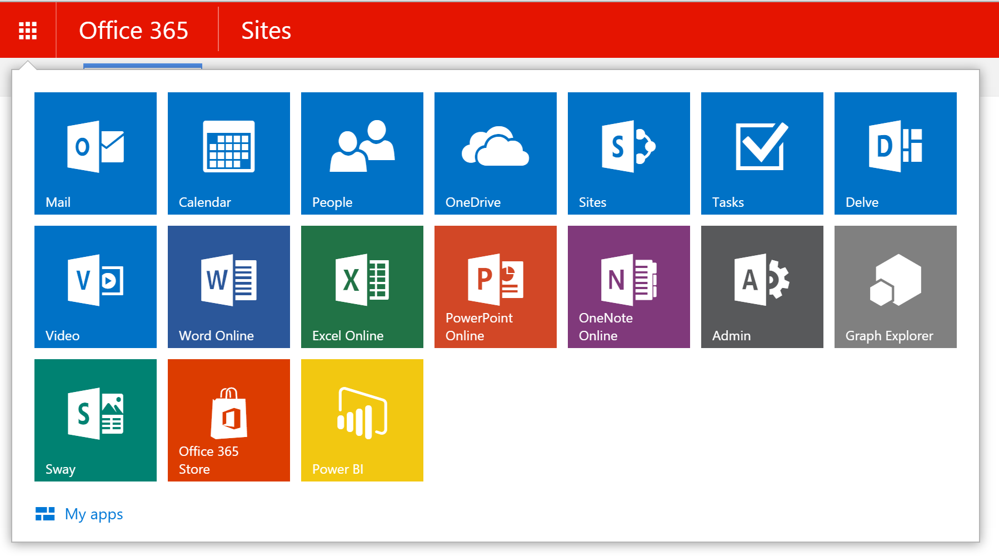

From there, you can directly start the PnP Partner Pack web application, by clicking on the
app icon, or you can even pin the app into the App Launcher.

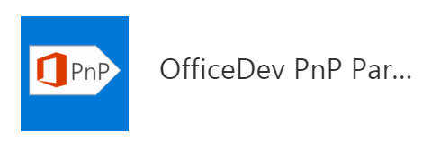

You will see the Home Page of the PnP Partner Pack.

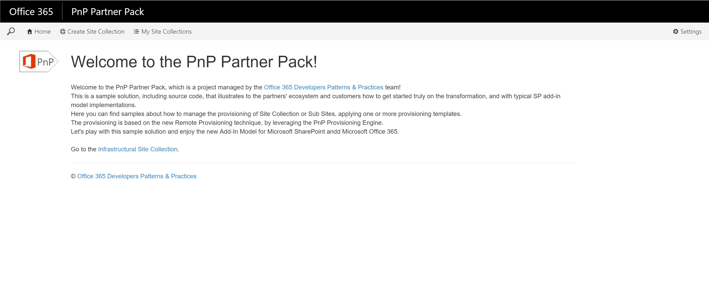

<a name="webjobs"></a>
###Azure Web Jobs provisioning
In order to automate the provisioning processes, as well as the governance rules enforcement
you have to provision some Azure Web Jobs. Here is the list:
* ScheduledJob: is a Job scheduled (the scheduling is up to you) that creates Site Collections,
and Applies Provisioning Templates to Sites. This job is available <a href="../OfficeDevPnP.PartnerPack.SiteProvisioning/OfficeDevPnP.PartnerPack.ScheduledJob">here</a>.
* ContinousJob: is a continously running Job that creates Sub Sites and Extracts Provisioning
Templates in near-real-time. This job is available <a href="../OfficeDevPnP.PartnerPack.SiteProvisioning/OfficeDevPnP.PartnerPack.ContinousJob">here</a>.
* CheckAdminJob: it is a scheduled Job, which checks that every Site Collection provisioned using the PnP Partner Pack has at least two Site Collection Administrators. 
If the check fails, the job sends and email alert to the unique Site Collection Administrator.
* ExternalUsersJob: this scheduled Job checks the status of the External Users for every Site Collection provisioned using the PnP Partner Pack.

In order to publish the Jobs, you will need to configure the App.Config of the jobs, providing 
almost the same parameters that you configured for the Web Application and/or the other Jobs.
To configured the jobs, you can use the <a href="../scripts/Configure-Configs.ps1">Configure-Configs.ps1</a> PowerShell script file
that is available in the <a href="../scripts/">Scripts folder</a> of this repository.

Moreover, you will have to publish them into the Azure Web App. To provision the Governance Jobs (*CheckAdminJob* and *ExternalUsersJob*) you can use
the <a href="../scripts/Provision-GovernanceTimerJobs.ps1">Provision-GovernanceTimerJobs.ps1</a> PowerShell script file
that is available in the <a href="../scripts/">Scripts folder</a> of this repository.

> Further details about how to publish Azure Web Jobs can be read in the following article: <a href="https://azure.microsoft.com/en-gb/documentation/articles/websites-dotnet-deploy-webjobs/">Deploy WebJobs using Visual Studio</a>.
