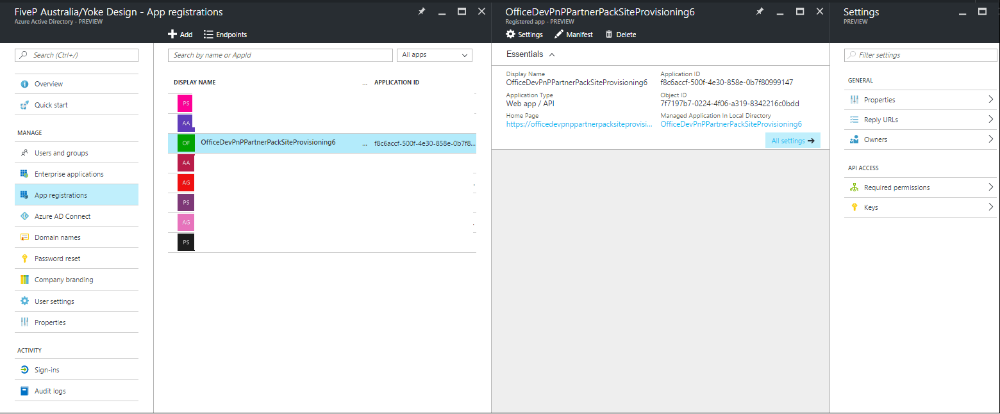
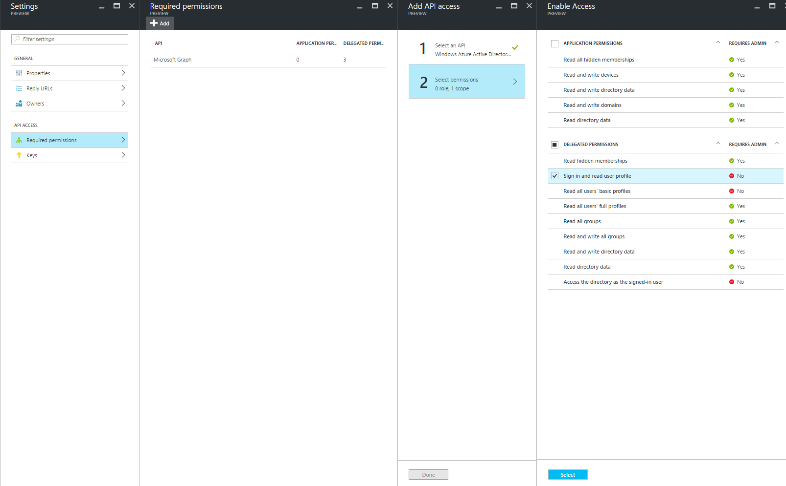
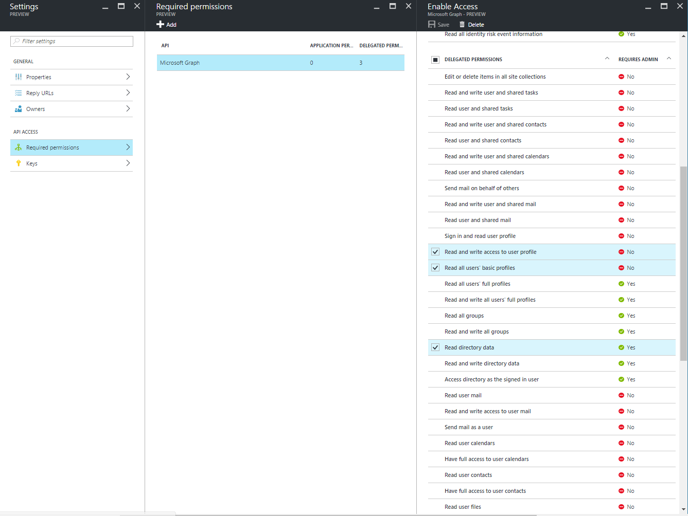
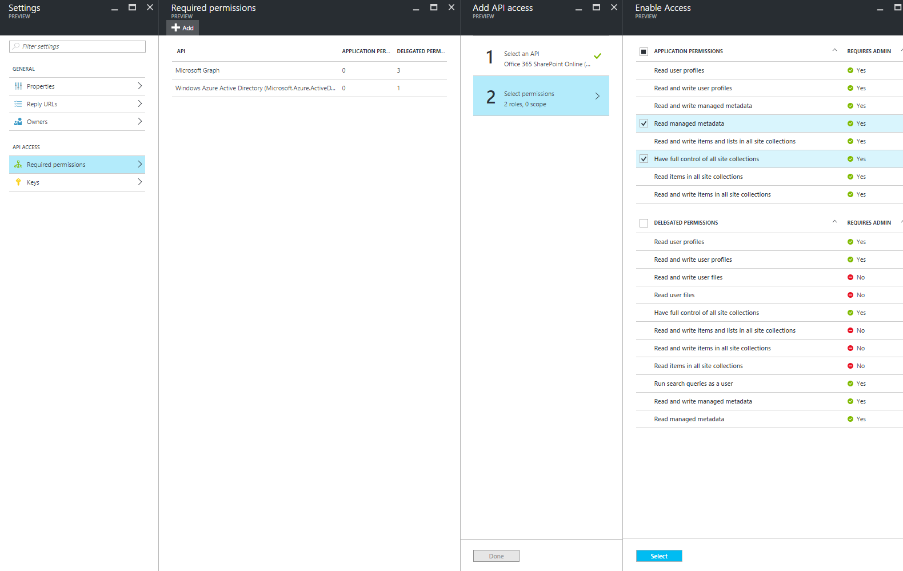

# PnP Partner Pack - Scripted Setup Guide

This document describes the scripted deployment for the **PnP Partner Pack version 2.0 (September 2016)**.
Follow step by step the detailed instructions provided in this document, if you like to automate most of the steps to setup the PnP Partner Pack version 2.0.

Otherwise, you will also be able to use a UI based desktop Setup application (for Windows OS only) that will be released pretty soon, and which allows you to fully automate the setup process.

## Setup Overview
From a deployment perspective the PnP Partner Pack is an Office 365 Application, which leverages an Azure Web App with an Azure Web Sites and some Azure Web Jobs. The application has to be registered in Azure Active Directory and acts against SharePoint Online using an App Only access token, based on an X.509 self-signed Certificate. Moreover, it is a requirement to have an Infrastructural Site Collection provisioned in the target SharePoint Online tenant.

This document outlines the scripted setup process, which allows you to use the PnP Partner Pack in your own environment.

If you already installed the PnP Partner Pack version 1.1 and you are upgrading it to the latest version, which currently is version 2.0, you can read the following <a href="./Upgrade-From-v1_1-to-v2_0.md">upgrade guide</a>, instead of reading this setup guide.

If you already installed the PnP Partner Pack version 1.0 and you are upgrading it to the latest version, which currently is version 2.0, you can read the following <a href="./Upgrade-From-v1_0-to-v2_0.md">upgrade guide</a>, instead of reading this setup guide.

Notice that the UI based desktop Setup application (for Windows OS only) that will be released pretty soon, will also provide the capability to upgrade an already installed version of the PnP Partner Pack.

## Requirements
In order to setup the PnP Partner Pack you need:
* A valid **Microsoft Office 365 tenant** with at least an active subscription
* The **PnP PowerShell cmdlets** (available here: http://aka.ms/OfficeDevPnPPowerShell). The minimum version you need is version 2.7.1609.2. To double-check the version of the PnP PowerShell cmdlets, you can invoke the `Connect-SPOOnline`  cmdlet with the `-Verbose` argument
*  **Azure Active Directory PowerShell Module - Version 2 *** (information here: https://msdn.microsoft.com/en-us/library/azure/mt757189.aspx) 
*  **Azure and Azure Resource Manager PowerShell Modules *** (information here: http://go.microsoft.com/fwlink/p/?LinkID=320552).
* **Visual Studio 2015 ***. Required if you wish to build, package and deploy solution. 

The scripted installation performs most of the steps required in order to deploy the Partner Pack Solution, however there are 2 manual step required after script has been completed.
* [Azure Active Directory Application API Access Required](#aad-apipermissions)
* [Configure Azure AD Application API Application Logo](#aad-applogo)

## Installation Steps
* [Execute Configure-PartnerPack.ps1](#partnerpackscript)


<a name="partnerpackscript"></a>
### Execute Configure-PartnerPack.ps1

Configure-PartnerPack.ps1 creates the resources required for this solution to work, and attempts to deploy the Partner Pack solution to the Azure Web App.
To run this open a PowerShell console, running as administrator (Certificate step requires admin permissions). Then navigate to the Partner Pack scripts folder 

```PowerShell
 ./Configure-PartnerPack.ps1
```


The following resources are expected to be created.
- 1 Resource group
- 1 Azure App Service Plan, same name as the one defined in ($config.AppServicePlanName)
- 1 Azure App Service , same name as the one defined in ($config.AppServiceName). This service also comes with the following artefacts
    - 3 Web jobs, ScheduledJob, EnforceAdminsJob, and ExternalUsersJob 
    - 1 self signed SSL Certificate
    - 1 Application Property, WEBSITE_LOAD_CERTIFICATES
    - App Service tier configured to Basic (default is Free)
- 1 Storage Account.     
    - please note that no storage account is created when there is a default one already configured in your subscription.
    - Storage account configured as default for the given Subscription.
- 1 Scheduler Job Collection
- 1 Azure AD Application. The following is also configured in this.
    - 1 Key credentials
    - 1 Password Credential, to be used as your app secret
On top of the changes above mentione the config files of all solution are expected to be updated to reflect the IDs, Urls and Secret configured during this process.

<a name="aad-apipermissions"></a>
### Configure Azure AD Application API Permissions
- Go to [Azure management portal](http://portal.azure.com) (portal.azure.com)
- Authenticate using your highly privileged account
- Navigate to Azure Active Directory
- Click App registrations. 
- Find your newly created application and click on it 
- Click Required permissions 
At this stage you are expected to see a screen similar to the following


Now you need to repeat the following process 3 times. 
- Click Add, 
- Select  API
- Select required permissions.
- Click Select
- Click done.  
- Ensure the following permissions are configured. 

    * Microsoft Graph (**Delegated Permission**)
      * **Read directory data**
      * **Read all users' basic profiles**
      * **Read and write access to user profile**
    * Windows Azure Active Directory (**Delegated Permission**)
      * **Sign in and read user profile**
    * Office 365 SharePoint Online (**Application Permission**)
      * **Read and write managed metadata**
      * **Have full control of all site collection**

for more information the following screenshots are provided
* Windows Azure Active Directory  


* Microsoft Graph  


* Office 365 SharePoint Online  



<a name="aad-applogo"></a>
### Configure Azure AD Application Logo

Go back to your Azure AD Application Settings and click PProperties.  You should now be at the following screen: 


Please make sure you :
- Upload the Application logo
- Press save. 


Now it is a good time to deploy the Partner Pack to your App Service instance. Please do that before you can use the solution/

You are now ready to play with your Office 365 Application. Simply open an Office 365 user session, click on the App Launcher and select the "My Apps" command.


From there, you can directly start the PnP Partner Pack web application, by clicking on the app icon, or you can even pin the app into the App Launcher.


You will see the Home Page of the PnP Partner Pack.


 
