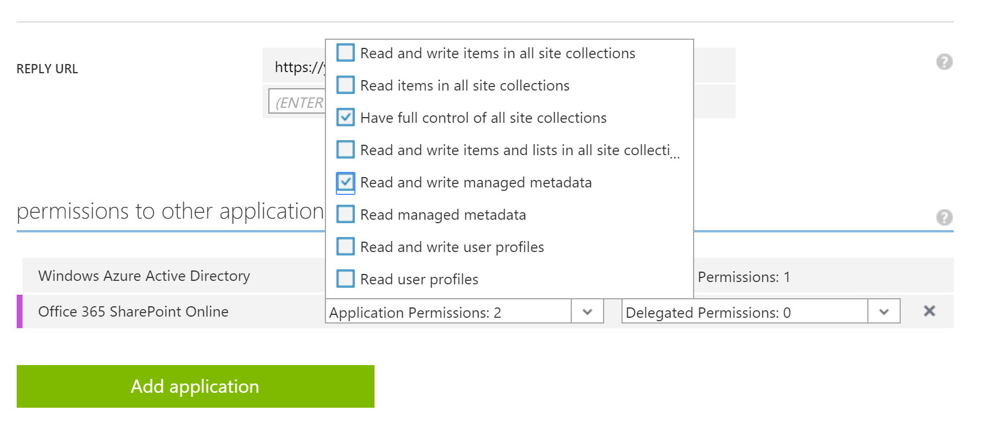

# PnP Partner Pack - Upgrade Guide from v. 1.0 to v. 1.1 

## Version overview
In the following list, you can find some new capabilities and some minor fixes that
were introduced with the PnP Partner Pack v. 1.1 (February 2016):
* Added the capability to consume the Microsoft Graph API, so far to show the currently
logged-in user's photo. Much more capabilities will come in the near future.
* Updated to use the latest CSOM package (16.1.4915.1200) and the latest PnP Core Library
 package (2.1.1602.1)
* Updated to use the latest versions of NuGet packages, to avoid deployment issues
* Updated and improved quality of documentation
* Fixed a bug related to site template extraction
* Fixed a bug related to the application of the responsive design
* Fixed a bug related to the preview image of a site template
* Improved error handling
* Fixed some other minor bugs

This document is about how to upgrade from the **PnP Partner Pack v. 1.0 (October 2015)**
to the **PnP Partner Pack v. 1.1 (February 2016)**.

## Upgrade Steps
In order to upgrade to the v. 1.1 of the PnP Partner Pack you will simply need to:
* Pull the updated source code from the GitHub repository, consuming the <a href="https://github.com/OfficeDev/PnP-Partner-Pack">master branch</a>
* Download all the required and updated NuGet packages at the solution level, for all the projects included in the solution
* Update the .config files of the projects defined in the solution by using the
<a href="../scripts/Configure-Configs.ps1">Configure-Configs.ps1</a> PowerShell script file
that is available in the 
<a href="../scripts/">Scripts folder</a> of this repository. This PowerShell script requires some input arguments, which are:
    * AzureStorageAccountName: the name of the storage account that will be used the infrastructural services and by the job
    * AzureStoragePrimaryAccessKey: the access key to consume the Azure Storage Account
    * ClientId: the OAuth ClientID registered in Azure AD for the PnP Partner Pack application 
    * ClientSecret: the OAuth Client Secret registered in Azure AD for the PnP Partner Pack application 
    * ADTenant: the tenant name of the target Microsoft Office 365 tenant (something like: tenant.onmicrosoft.com)
    * CertificateThumbprint: the thumbprint of the X.509 certificate that will be used for App-Only authentication
    * InfrastructureSiteUrl: the URL of the SharePoint Online infrastructural Site Collection for the PnP Partner Pack 
* Refresh the publishing on Microsoft Azure of the PnP Partner Pack web application (OfficeDevPnP.PartnerPack.SiteProvisioning) and of the two related Azure Web Jobs (OfficeDevPnP.PartnerPack.ContinousJob and OfficeDevPnP.PartnerPack.ScheduledJob).
* Update the permissions for the application in Azure Active Directory, accordingly to the following list of permissions:
    * Office 365 SharePoint Online (Application Permission)
        * Have full control of all site collection
        * Read and write managed metadata
    * Microsoft Graph (Delegated Permission) (**New**)
        * Read and write access to user profile
* Ensure the application in Azure Active Directory has reply URL(s) that have a trailing slash (/)

For further details about how to configure the permissions, see the following figure.

Enjoy the refresh PnP Partner Pack!